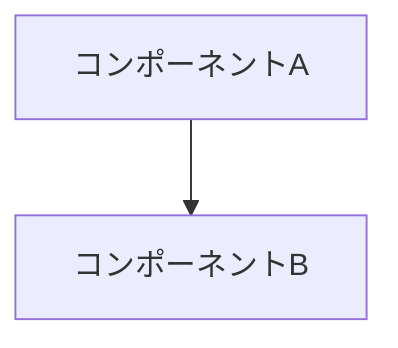

# VS Code Spec Kit 最適化設定

> **GitHub Copilot + Spec Kit を最大限活用するための VS Code 環境設定ガイド**

このドキュメントでは、Spec Kitでの開発効率を最大化するためのVS Code設定、推奨拡張機能、カスタマイズ方法について詳しく説明します。

## 📋 目次

1. [必須拡張機能](#必須拡張機能)
2. [推奨拡張機能](#推奨拡張機能)
3. [VS Code設定](#vs-code設定)
4. [ワークスペース設定](#ワークスペース設定)
5. [キーボードショートカット](#キーボードショートカット)
6. [スニペット設定](#スニペット設定)
7. [テンプレート設定](#テンプレート設定)
8. [トラブルシューティング](#トラブルシューティング)

## 🔧 必須拡張機能

### 1. GitHub Copilot 関連

```json
{
  "recommendations": [
    "github.copilot",
    "github.copilot-chat"
  ]
}
```

**設定項目:**
```json
{
  "github.copilot.enable": {
    "markdown": true,
    "plaintext": true,
    "yaml": true
  },
  "github.copilot.advanced": {
    "top_p": 0.1,
    "temperature": 0.1,
    "length": 500
  },
  "github.copilot-chat.localeOverride": "ja"
}
```

### 2. Markdown 支援

```json
{
  "recommendations": [
    "yzhang.markdown-all-in-one",
    "shd101wyy.markdown-preview-enhanced",
    "davidanson.vscode-markdownlint"
  ]
}
```

**重要設定:**
```json
{
  "markdown.preview.breaks": true,
  "markdown.preview.typographer": true,
  "markdownlint.config": {
    "MD013": false,
    "MD033": false,
    "MD041": false
  }
}
```

### 3. Git 統合

```json
{
  "recommendations": [
    "eamodio.gitlens",
    "github.vscode-pull-request-github"
  ]
}
```

## 🚀 推奨拡張機能

### 開発効率化

```json
{
  "recommendations": [
    "ms-vscode.vscode-json",
    "redhat.vscode-yaml",
    "ms-python.python",
    "ms-vscode.vscode-typescript-next",
    "bradlc.vscode-tailwindcss",
    "esbenp.prettier-vscode",
    "ms-vscode.vscode-eslint"
  ]
}
```

### 図表・可視化

```json
{
  "recommendations": [
    "bierner.markdown-mermaid",
    "jebbs.plantuml",
    "hediet.vscode-drawio"
  ]
}
```

### プロジェクト管理

```json
{
  "recommendations": [
    "alefragnani.project-manager",
    "gruntfuggly.todo-tree",
    "aaron-bond.better-comments"
  ]
}
```

## ⚙️ VS Code設定

### settings.json

```json
{
  // GitHub Copilot 最適化
  "github.copilot.enable": {
    "*": true,
    "markdown": true,
    "plaintext": true
  },
  "github.copilot.advanced": {
    "top_p": 0.1,
    "temperature": 0.1
  },
  
  // エディタ設定
  "editor.fontSize": 14,
  "editor.lineHeight": 1.6,
  "editor.fontFamily": "'Fira Code', 'Consolas', monospace",
  "editor.fontLigatures": true,
  "editor.wordWrap": "on",
  "editor.rulers": [80, 120],
  "editor.minimap.enabled": false,
  
  // ファイル処理
  "files.autoSave": "afterDelay",
  "files.autoSaveDelay": 1000,
  "files.trimTrailingWhitespace": true,
  "files.insertFinalNewline": true,
  
  // 検索・置換
  "search.exclude": {
    "**/node_modules": true,
    "**/dist": true,
    "**/build": true,
    "**/.git": true
  },
  
  // Markdown 設定
  "markdown.preview.breaks": true,
  "markdown.preview.typographer": true,
  "markdown.extension.toc.levels": "2..6",
  "markdown.extension.preview.autoShowPreviewToSide": true,
  
  // 日本語対応
  "workbench.colorTheme": "GitHub Dark",
  "editor.unicodeHighlight.ambiguousCharacters": false,
  "editor.unicodeHighlight.invisibleCharacters": false,
  
  // ターミナル設定
  "terminal.integrated.fontSize": 13,
  "terminal.integrated.fontFamily": "'Fira Code', monospace",
  "terminal.integrated.shell.linux": "/bin/bash",
  
  // Git 設定
  "git.enableSmartCommit": true,
  "git.confirmSync": false,
  "git.autofetch": true,
  "gitlens.currentLine.enabled": false,
  "gitlens.hovers.currentLine.over": "line",
  
  // 拡張機能設定
  "todo-tree.regex.regex": "(//|#|<!--|;|/\\*|^|^\\s*(-|\\*|\\+|\\>))\\s*($TAGS)",
  "todo-tree.general.tags": [
    "TODO",
    "FIXME", 
    "SPEC",
    "PLAN",
    "TASK"
  ],
  
  // フォーマット設定
  "editor.formatOnSave": true,
  "editor.defaultFormatter": "esbenp.prettier-vscode",
  "[markdown]": {
    "editor.defaultFormatter": "yzhang.markdown-all-in-one",
    "editor.wordWrap": "on",
    "editor.quickSuggestions": {
      "comments": "off",
      "strings": "off",
      "other": "off"
    }
  },
  
  // IntelliSense 設定
  "editor.suggestSelection": "first",
  "vsintellicode.modify.editor.suggestSelection": "automaticallyOverrodeDefaultValue",
  "editor.tabCompletion": "on",
  "editor.suggest.localityBonus": true
}
```

## 🏢 ワークスペース設定

### .vscode/settings.json (プロジェクト固有)

```json
{
  "files.associations": {
    "spec.md": "markdown",
    "plan.md": "markdown", 
    "tasks.md": "markdown",
    "Constitution.md": "markdown"
  },
  
  "search.include": {
    "specs/**": true,
    "docs/**": true,
    "README.md": true
  },
  
  "files.watcherExclude": {
    "**/node_modules/**": true,
    "**/dist/**": true,
    "**/.git/**": true
  },
  
  // Spec Kit 固有設定
  "markdown.extension.toc.githubCompatibility": true,
  "markdown.extension.toc.slugifyMode": "github",
  
  // プロジェクトテンプレート
  "emmet.includeLanguages": {
    "markdown": "html"
  },
  
  // 自動保存設定
  "files.autoSave": "afterDelay",
  "files.autoSaveDelay": 500
}
```

### .vscode/tasks.json

```json
{
  "version": "2.0.0",
  "tasks": [
    {
      "label": "Spec Kit: Create Specification",
      "type": "shell",
      "command": "uvx --from git+https://github.com/github/spec-kit.git specify",
      "args": ["${input:specDescription}"],
      "group": "build",
      "presentation": {
        "echo": true,
        "reveal": "always",
        "focus": false,
        "panel": "shared"
      },
      "problemMatcher": []
    },
    {
      "label": "Spec Kit: Create Plan", 
      "type": "shell",
      "command": "uvx --from git+https://github.com/github/spec-kit.git plan",
      "args": ["${file}"],
      "group": "build",
      "presentation": {
        "echo": true,
        "reveal": "always", 
        "focus": false,
        "panel": "shared"
      },
      "problemMatcher": []
    },
    {
      "label": "Spec Kit: Create Tasks",
      "type": "shell", 
      "command": "uvx --from git+https://github.com/github/spec-kit.git tasks",
      "args": ["${file}"],
      "group": "build",
      "presentation": {
        "echo": true,
        "reveal": "always",
        "focus": false, 
        "panel": "shared"
      },
      "problemMatcher": []
    },
    {
      "label": "Spec Kit: Validate All",
      "type": "shell",
      "command": "uvx --from git+https://github.com/github/spec-kit.git specify",
      "args": ["validate", "specs/"],
      "group": "test",
      "presentation": {
        "echo": true,
        "reveal": "always",
        "focus": false,
        "panel": "shared"
      },
      "problemMatcher": []
    }
  ],
  "inputs": [
    {
      "id": "specDescription", 
      "description": "仕様の説明を入力してください",
      "default": "",
      "type": "promptString"
    }
  ]
}
```

### .vscode/launch.json

```json
{
  "version": "0.2.0",
  "configurations": [
    {
      "name": "Preview Markdown",
      "type": "node",
      "request": "launch", 
      "program": "${workspaceFolder}/node_modules/.bin/markdown-preview-enhanced",
      "args": ["${file}"],
      "console": "integratedTerminal"
    }
  ]
}
```

## ⌨️ キーボードショートカット

### keybindings.json

```json
[
  // Spec Kit ショートカット
  {
    "key": "ctrl+shift+s",
    "command": "workbench.action.tasks.runTask",
    "args": "Spec Kit: Create Specification"
  },
  {
    "key": "ctrl+shift+p", 
    "command": "workbench.action.tasks.runTask",
    "args": "Spec Kit: Create Plan"
  },
  {
    "key": "ctrl+shift+t",
    "command": "workbench.action.tasks.runTask", 
    "args": "Spec Kit: Create Tasks"
  },
  
  // Markdown 編集
  {
    "key": "ctrl+shift+v",
    "command": "markdown.showPreviewToSide",
    "when": "editorLangId == 'markdown'"
  },
  {
    "key": "ctrl+k v",
    "command": "markdown.showPreview",
    "when": "editorLangId == 'markdown'"
  },
  
  // GitHub Copilot
  {
    "key": "ctrl+shift+i",
    "command": "github.copilot.generate"
  },
  {
    "key": "ctrl+shift+c",
    "command": "workbench.panel.chat.view.copilot.focus"
  },
  
  // ファイル操作
  {
    "key": "ctrl+shift+n",
    "command": "explorer.newFolder"
  },
  {
    "key": "ctrl+shift+f",
    "command": "workbench.action.findInFiles"
  },
  
  // Git 操作
  {
    "key": "ctrl+shift+g",
    "command": "workbench.view.scm"
  },
  {
    "key": "ctrl+enter",
    "command": "git.commitAll"
  }
]
```

## 📝 スニペット設定

### markdown.json (ユーザースニペット)

```json
{
  "Spec Kit: New Specification": {
    "prefix": "spec-new",
    "body": [
      "# ${1:Feature Name}",
      "",
      "## 概要",
      "${2:この機能の概要説明}",
      "",
      "## 目的・背景",
      "${3:なぜこの機能が必要か}",
      "",
      "## 機能要件",
      "### 基本機能",
      "- ${4:基本的な機能}",
      "",
      "### 詳細仕様",
      "${5:詳細な仕様説明}",
      "",
      "## 非機能要件",
      "- **パフォーマンス**: ${6:レスポンス時間、スループット等}",
      "- **セキュリティ**: ${7:認証、認可、データ保護等}",
      "- **可用性**: ${8:稼働率、障害対応等}",
      "",
      "## 技術選定",
      "- **フロントエンド**: ${9:使用技術}",
      "- **バックエンド**: ${10:使用技術}",
      "- **データベース**: ${11:使用技術}",
      "",
      "## 実装方針",
      "${12:実装の方針・アプローチ}",
      "",
      "## テスト戦略",
      "- **ユニットテスト**: ${13:テスト範囲}",
      "- **統合テスト**: ${14:テスト範囲}",
      "- **E2Eテスト**: ${15:テスト範囲}",
      "",
      "## リスク・課題",
      "${16:予想されるリスクと対策}",
      "",
      "## 受け入れ条件",
      "- [ ] ${17:検証可能な条件1}",
      "- [ ] ${18:検証可能な条件2}",
      "",
      "## 参考資料",
      "- ${19:関連ドキュメント、API仕様等}"
    ],
    "description": "新しい仕様書のテンプレート"
  },
  
  "Spec Kit: Implementation Plan": {
    "prefix": "plan-new", 
    "body": [
      "# ${1:Feature Name} 実装計画",
      "",
      "## 実装概要",
      "${2:実装の概要説明}",
      "",
      "## フェーズ分割",
      "### フェーズ1: ${3:フェーズ1の内容}",
      "**期間**: ${4:X週間}",
      "**目標**: ${5:フェーズ1の目標}",
      "",
      "### フェーズ2: ${6:フェーズ2の内容}",
      "**期間**: ${7:X週間}",
      "**目標**: ${8:フェーズ2の目標}",
      "",
      "## 技術アーキテクチャ",
      "```mermaid",
      "graph TD",
      "    A[${9:コンポーネントA}] --> B[${10:コンポーネントB}]",
      "    B --> C[${11:コンポーネントC}]",
      "```",
      "",
      "## 依存関係",
      "- ${12:依存関係1}",
      "- ${13:依存関係2}",
      "",
      "## リスク対策",
      "| リスク | 影響 | 対策 |",
      "|--------|------|------|",
      "| ${14:リスク1} | ${15:影響度} | ${16:対策1} |",
      "",
      "## デプロイ計画",
      "${17:デプロイ方針・手順}",
      "",
      "## 品質保証",
      "- **コードレビュー**: ${18:レビュー基準}",
      "- **テスト**: ${19:テスト実行計画}",
      "- **パフォーマンス**: ${20:パフォーマンス検証}",
      "",
      "## スケジュール",
      "| 作業項目 | 開始予定 | 完了予定 | 担当者 |",
      "|----------|----------|----------|--------|",
      "| ${21:作業1} | ${22:開始日} | ${23:完了日} | ${24:担当者} |"
    ],
    "description": "実装計画のテンプレート"
  },
  
  "Spec Kit: Task List": {
    "prefix": "tasks-new",
    "body": [
      "# ${1:Feature Name} タスク一覧",
      "",
      "## 開発タスク",
      "### 環境準備",
      "- [ ] ${2:開発環境セットアップ}",
      "- [ ] ${3:必要なライブラリ・ツール導入}",
      "",
      "### 実装タスク",
      "- [ ] ${4:タスク1} (見積: ${5:X}時間)",
      "  - ${6:詳細説明}",
      "- [ ] ${7:タスク2} (見積: ${8:X}時間)",
      "  - ${9:詳細説明}",
      "",
      "### テストタスク", 
      "- [ ] ${10:ユニットテスト作成}",
      "- [ ] ${11:統合テスト作成}",
      "- [ ] ${12:E2Eテスト作成}",
      "",
      "## レビュー・品質保証",
      "- [ ] ${13:コードレビュー}",
      "- [ ] ${14:セキュリティレビュー}",
      "- [ ] ${15:パフォーマンステスト}",
      "",
      "## ドキュメント作成",
      "- [ ] ${16:API仕様書更新}",
      "- [ ] ${17:ユーザーマニュアル更新}",
      "- [ ] ${18:運用マニュアル更新}",
      "",
      "## デプロイ・リリース",
      "- [ ] ${19:ステージング環境デプロイ}",
      "- [ ] ${20:本番環境デプロイ}",
      "- [ ] ${21:リリース後確認}",
      "",
      "## 完了条件",
      "- [ ] ${22:受け入れテスト完了}",
      "- [ ] ${23:ステークホルダー承認}",
      "- [ ] ${24:ドキュメント整備完了}"
    ],
    "description": "タスク一覧のテンプレート"
  },

  "Mermaid Diagram": {
    "prefix": "mermaid",
    "body": [
      "```mermaid",
      "${1|graph TD,graph LR,sequenceDiagram,classDiagram,erDiagram|}",
      "    ${2:A --> B}",
      "```"
    ],
    "description": "Mermaid図表のテンプレート"
  },

  "GitHub Copilot Prompt": {
    "prefix": "copilot-prompt",
    "body": [
      "<!-- GitHub Copilot プロンプト -->",
      "<!-- ${1:実装したい機能の説明} -->",
      "<!-- 要件: ${2:具体的な要件} -->",
      "<!-- 制約: ${3:技術制約や注意点} -->",
      "<!-- 期待する結果: ${4:期待する実装内容} -->"
    ],
    "description": "GitHub Copilot用のプロンプトテンプレート"
  }
}
```

## 📋 テンプレート設定

### .vscode/templates/spec.md

```markdown
# ${TM_FILENAME_BASE}

## 概要
<!-- この機能の概要を記述 -->

## 目的・背景
<!-- なぜこの機能が必要かを説明 -->

## 機能要件
### 基本機能
<!-- 必須の機能を列挙 -->

### 詳細仕様
<!-- 詳細な仕様を記述 -->

## 非機能要件
- **パフォーマンス**: 
- **セキュリティ**: 
- **可用性**: 

## 技術選定
- **フロントエンド**: 
- **バックエンド**: 
- **データベース**: 

## 実装方針
<!-- 実装のアプローチを説明 -->

## テスト戦略
- **ユニットテスト**: 
- **統合テスト**: 
- **E2Eテスト**: 

## リスク・課題
<!-- 予想されるリスクと対策 -->

## 受け入れ条件
- [ ] 
- [ ] 

## 参考資料
<!-- 関連ドキュメント、API仕様等 -->
```

### .vscode/templates/plan.md

```markdown
# ${TM_FILENAME_BASE} 実装計画

## 実装概要
<!-- 実装の概要を説明 -->

## フェーズ分割
### フェーズ1: 
**期間**: 
**目標**: 

### フェーズ2: 
**期間**: 
**目標**: 

## 技術アーキテクチャ


## 依存関係
<!-- 他システムや前提条件 -->

## リスク対策
| リスク | 影響 | 対策 |
|--------|------|------|
|        |      |      |

## デプロイ計画
<!-- デプロイ方針・手順 -->

## 品質保証
- **コードレビュー**: 
- **テスト**: 
- **パフォーマンス**: 

## スケジュール
| 作業項目 | 開始予定 | 完了予定 | 担当者 |
|----------|----------|----------|--------|
|          |          |          |        |
```

## 🔧 ワークフロー自動化

### .vscode/spec-workflow.code-snippets

```json
{
  "Create New Feature Spec": {
    "scope": "markdown",
    "prefix": "new-feature",
    "body": [
      "# ${1:Feature Name}",
      "",
      "> **作成日**: ${CURRENT_DATE}",
      "> **作成者**: ${2:作成者名}",
      "> **ステータス**: 📝 作成中",
      "",
      "## 📋 概要",
      "${3:この機能の概要説明}",
      "",
      "## 🎯 目的・背景",
      "### ビジネス価値",
      "${4:提供するビジネス価値}",
      "",
      "### 解決する課題",
      "${5:解決したい課題}",
      "",
      "## ⚙️ 機能要件",
      "### 🔧 基本機能",
      "1. ${6:基本機能1}",
      "2. ${7:基本機能2}",
      "",
      "### 📊 詳細仕様",
      "#### ${8:機能名1}",
      "```",
      "${9:詳細説明}",
      "```",
      "",
      "## 🏗️ 非機能要件",
      "| 項目 | 要件 | 測定方法 |",
      "|------|------|----------|",
      "| パフォーマンス | ${10:応答時間} | ${11:測定方法} |",
      "| セキュリティ | ${12:セキュリティ要件} | ${13:検証方法} |",
      "| 可用性 | ${14:稼働率} | ${15:監視方法} |",
      "",
      "## 🛠️ 技術選定",
      "```yaml",
      "frontend:",
      "  framework: ${16:フレームワーク}",
      "  reasoning: ${17:選定理由}",
      "",
      "backend:",
      "  framework: ${18:フレームワーク}",
      "  reasoning: ${19:選定理由}",
      "",
      "database:",
      "  type: ${20:データベース種別}",
      "  reasoning: ${21:選定理由}",
      "```",
      "",
      "## 🧪 テスト戦略",
      "### ユニットテスト",
      "- カバレッジ目標: ${22:90%以上}",
      "- 対象: ${23:テスト対象}",
      "",
      "### 統合テスト",
      "- 対象: ${24:統合テスト対象}",
      "- シナリオ: ${25:テストシナリオ}",
      "",
      "### E2Eテスト",
      "- 対象: ${26:E2Eテスト対象}",
      "- ツール: ${27:使用ツール}",
      "",
      "## ⚠️ リスク・課題",
      "| リスク | 影響度 | 対策 |",
      "|--------|--------|------|",
      "| ${28:リスク1} | ${29:高/中/低} | ${30:対策1} |",
      "",
      "## ✅ 受け入れ条件",
      "- [ ] ${31:検証可能な条件1}",
      "- [ ] ${32:検証可能な条件2}",
      "- [ ] ${33:検証可能な条件3}",
      "",
      "## 📚 参考資料",
      "- [${34:資料名}](${35:URL})",
      "",
      "---",
      "",
      "## 📝 作業ログ",
      "### ${CURRENT_DATE}",
      "- 📝 初期仕様を作成",
      "",
      "## 🔄 次のステップ",
      "1. [ ] 仕様レビュー依頼",
      "2. [ ] 実装計画作成 (/plan)",
      "3. [ ] タスク分解 (/tasks)"
    ],
    "description": "包括的な機能仕様テンプレート"
  }
}
```

## 🐛 トラブルシューティング

### よくある問題と解決方法

#### 1. GitHub Copilot が動作しない

**症状**: Copilot の提案が表示されない

**解決方法**:
```bash
# 1. 拡張機能の確認
# VS Code > 拡張機能 > GitHub Copilot が有効化されているか確認

# 2. アカウント認証の確認
# VS Code > コマンドパレット > "GitHub Copilot: Sign in"

# 3. 設定の確認
# settings.json で github.copilot.enable が true になっているか確認

# 4. 拡張機能の再インストール
# 拡張機能をアンインストール → 再インストール

# 5. VS Code の再起動
```

#### 2. Markdown プレビューが正しく表示されない

**症状**: Mermaid図表やMath式が表示されない

**解決方法**:
```json
{
  "markdown-preview-enhanced.enableTypographer": true,
  "markdown-preview-enhanced.mathRenderingOption": "KaTeX",
  "markdown-preview-enhanced.mermaidTheme": "default",
  "markdown-preview-enhanced.codeBlockTheme": "github.css"
}
```

#### 3. Spec Kit コマンドが実行できない

**症状**: uvx コマンドが見つからない

**解決方法**:
```bash
# 1. Python/pip の確認
python3 --version
pip3 --version

# 2. uvx のインストール
pip3 install uv
uv tool install uvx

# 3. PATH の確認
echo $PATH

# 4. 手動実行テスト
uvx --from git+https://github.com/github/spec-kit.git specify --help
```

#### 4. ファイル監視が機能しない

**症状**: ファイル変更が自動で反映されない

**解決方法**:
```json
{
  "files.watcherExclude": {
    "**/node_modules/**": true,
    "**/.git/**": true,
    "**/dist/**": true
  },
  "files.useExperimentalFileWatcher": true
}
```

#### 5. 日本語入力で問題が発生

**症状**: 日本語入力時に Copilot が正しく動作しない

**解決方法**:
```json
{
  "editor.unicodeHighlight.ambiguousCharacters": false,
  "editor.unicodeHighlight.invisibleCharacters": false,
  "github.copilot-chat.localeOverride": "ja",
  "editor.suggest.localityBonus": true
}
```

### パフォーマンス最適化

#### メモリ使用量の削減

```json
{
  "extensions.autoUpdate": false,
  "editor.minimap.enabled": false,
  "editor.hover.delay": 1000,
  "editor.lightbulb.enabled": false,
  "breadcrumbs.enabled": false,
  "workbench.editor.enablePreview": false,
  "workbench.editor.enablePreviewFromQuickOpen": false
}
```

#### 起動速度の改善

```json
{
  "window.restoreFullscreen": true,
  "window.restoreWindows": "none",
  "workbench.startupEditor": "none",
  "git.autoRepositoryDetection": false,
  "npm.autoDetect": "off",
  "typescript.surveys.enabled": false
}
```

### セキュリティ設定

#### 機密情報の保護

```json
{
  "github.copilot.advanced": {
    "listCount": 10,
    "inlineSuggestCount": 3
  },
  "github.copilot.enable": {
    "plaintext": true,
    "markdown": true,
    "scminput": false
  },
  "files.exclude": {
    "**/.env": true,
    "**/secrets.json": true,
    "**/*.pem": true,
    "**/*.key": true
  }
}
```

## 📊 設定の検証

### 設定チェックスクリプト

```bash
#!/bin/bash
# scripts/check-vscode-config.sh

echo "🔍 VS Code Spec Kit 設定チェック"

# 1. 必須拡張機能の確認
echo "📦 拡張機能チェック..."
required_extensions=(
    "github.copilot"
    "github.copilot-chat"
    "yzhang.markdown-all-in-one"
    "eamodio.gitlens"
)

for ext in "${required_extensions[@]}"; do
    if code --list-extensions | grep -q "$ext"; then
        echo "✅ $ext がインストールされています"
    else
        echo "❌ $ext がインストールされていません"
    fi
done

# 2. 設定ファイルの確認
echo -e "\n⚙️ 設定ファイルチェック..."
config_files=(
    ".vscode/settings.json"
    ".vscode/tasks.json"
    ".vscode/keybindings.json"
)

for file in "${config_files[@]}"; do
    if [ -f "$file" ]; then
        echo "✅ $file が存在します"
    else
        echo "⚠️ $file が見つかりません"
    fi
done

# 3. Spec Kit 動作確認
echo -e "\n🛠️ Spec Kit 動作チェック..."
if command -v uvx >/dev/null 2>&1; then
    echo "✅ uvx コマンドが利用可能です"
    if uvx --from git+https://github.com/github/spec-kit.git specify --help >/dev/null 2>&1; then
        echo "✅ Spec Kit が正常に動作します"
    else
        echo "❌ Spec Kit の実行に問題があります"
    fi
else
    echo "❌ uvx コマンドが見つかりません"
fi

echo -e "\n🎉 設定チェック完了"
```

---

**この設定ガイドを活用して、GitHub Copilot + Spec Kit での開発効率を最大化しましょう。定期的に設定を見直し、チームの働き方に合わせてカスタマイズすることをお勧めします。**