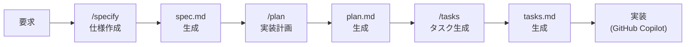
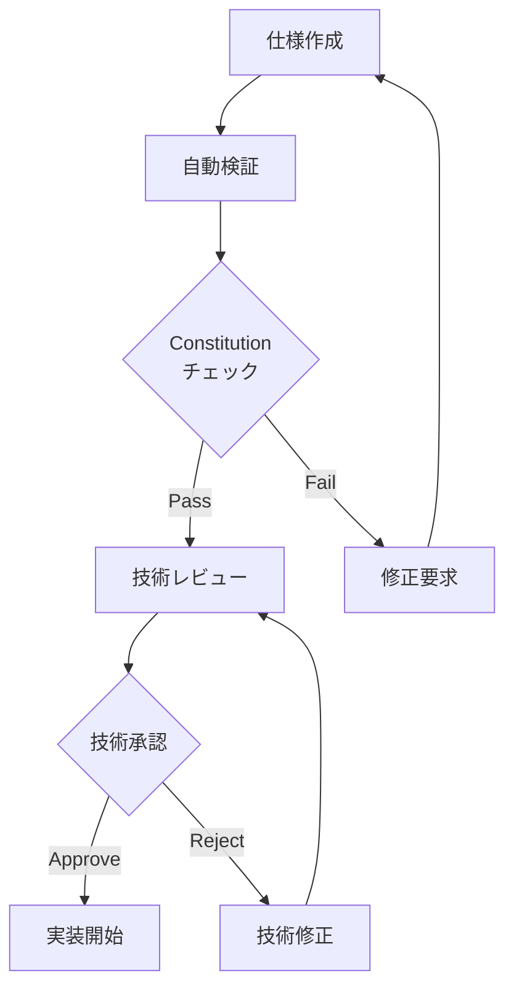

# GitHub Copilot Spec Kit コマンドリファレンス

> **`/specify`, `/plan`, `/tasks` コマンドの詳細使用方法と実践的プロンプト例集**

このリファレンスでは、GitHub Copilot で使用するSpec Kit の3つの主要コマンドの詳細な使用方法、効果的なプロンプト例、トラブルシューティングを提供します。

## 📋 目次

1. [コマンド概要](#コマンド概要)
2. [`/specify` - 仕様作成](#specify---仕様作成)
3. [`/plan` - 実装計画](#plan---実装計画)
4. [`/tasks` - タスク生成](#tasks---タスク生成)
5. [プロンプトパターン集](#プロンプトパターン集)
6. [トラブルシューティング](#トラブルシューティング)
7. [高度な活用方法](#高度な活用方法)

## 🔧 コマンド概要

### Spec Kit ワークフロー



### コマンド一覧

| コマンド | 入力 | 出力 | 用途 |
|---------|------|------|------|
| `/specify` | 自然言語の要求 | `spec.md` | 要求を技術仕様に変換 |
| `/plan` | `spec.md` | `plan.md` | 仕様を実装計画に変換 |
| `/tasks` | `plan.md` | `tasks.md` | 計画を具体的タスクに分解 |

## 📝 `/specify` - 仕様作成

### 基本的な使用方法

#### コマンド形式

```bash
/specify [詳細な要求記述]
```

#### 基本例

```bash
/specify ユーザー認証システムを作りたい
```

### 効果的なプロンプトの書き方

#### 1. 構造化された要求

```bash
/specify 
Node.js + TypeScript でユーザー認証システムを実装したい。

## 機能要件
- ユーザー登録（メール・パスワード）
- ログイン・ログアウト
- パスワードリセット
- プロフィール管理

## 非機能要件
- 同時接続: 1000人
- レスポンス時間: 100ms以下
- 可用性: 99.9%

## 技術制約
- バックエンド: Node.js 18+ + TypeScript
- データベース: PostgreSQL + Prisma
- 認証: JWT
- セッション管理: Redis
- API形式: REST
```

#### 2. レベル別詳細化

**Level 1: 概要レベル**
```bash
/specify 
ECサイトのバックエンドAPIを作成したい。
商品管理、ユーザー管理、注文処理の基本機能が必要。
```

**Level 2: 機能レベル**
```bash
/specify
ECサイトの商品管理機能を詳細化したい。

要件:
- 商品のCRUD操作
- カテゴリー管理
- 在庫管理
- 価格・割引管理
- 商品検索・フィルタリング
- 商品画像アップロード

技術スタック:
- Node.js + TypeScript
- PostgreSQL + Prisma
- Redis でキャッシュ
- AWS S3 で画像保存
```

**Level 3: 技術レベル**
```bash
/specify
商品検索APIの具体的な実装仕様を作成したい。

要件:
- 全文検索: 商品名、説明、タグで検索
- フィルター: カテゴリー、価格帯、ブランド、評価
- ソート: 価格、人気度、新着順、評価順
- ページネーション: 20件/ページ
- レスポンス時間: 50ms以下
- 検索候補機能（オートコンプリート）

技術制約:
- Elasticsearch または PostgreSQL Full-text Search
- Redis でクエリ結果キャッシュ (TTL: 5分)
- CDN でレスポンス高速化
```

### ドメイン別プロンプト例

#### Web API 開発

```bash
/specify
マイクロサービス向けのREST APIを作成したい。

サービス概要:
- ユーザー管理サービス
- 認証・認可機能
- プロフィール管理
- 組織・チーム管理

技術要件:
- Node.js + TypeScript + Express.js
- PostgreSQL + Prisma ORM
- Redis でセッション・キャッシュ
- Docker コンテナ化
- Kubernetes デプロイ
- API仕様: OpenAPI 3.0

非機能要件:
- RPS: 10,000 requests/second
- レスポンス時間: 99%ile < 100ms
- 可用性: 99.99%
- セキュリティ: OAUTH2 + JWT
```

#### フロントエンド開発

```bash
/specify
React + TypeScript のSPAを作成したい。

機能要件:
- ダッシュボード画面
- データ可視化（チャート・グラフ）
- リアルタイムデータ更新
- レスポンシブデザイン
- ダークモード対応

技術要件:
- React 18 + TypeScript
- Next.js (App Router)
- Tailwind CSS
- Chart.js または D3.js
- WebSocket でリアルタイム通信
- PWA 対応

パフォーマンス要件:
- First Contentful Paint < 1.5s
- Largest Contentful Paint < 2.5s
- Cumulative Layout Shift < 0.1
```

#### データ処理・分析

```bash
/specify
大量データの分析・処理システムを構築したい。

処理要件:
- 日次 100GB のログデータ処理
- リアルタイム異常検知
- 集計・レポート生成
- 機械学習モデルの推論

技術要件:
- Python 3.11 + FastAPI
- Apache Kafka でストリーミング
- Apache Spark でバッチ処理
- PostgreSQL + ClickHouse
- Redis でキャッシュ
- scikit-learn + pandas

インフラ要件:
- AWS or GCP
- Kubernetes
- Auto Scaling
- 監視・アラート
```

#### モバイルアプリ開発

```bash
/specify
React Native でクロスプラットフォームアプリを作成したい。

機能要件:
- ユーザー認証
- プッシュ通知
- オフライン対応
- 位置情報サービス
- カメラ・写真機能
- ソーシャルログイン

技術要件:
- React Native + TypeScript
- Expo SDK
- Firebase Authentication
- Firebase Cloud Messaging
- AsyncStorage
- React Navigation v6

パフォーマンス要件:
- アプリ起動時間 < 3秒
- 画面遷移 < 300ms
- バッテリー消費最適化
```

### よくある問題と改善例

#### ❌ 悪い例

```bash
# 曖昧で情報不足
/specify ウェブサイトを作りたい

# 技術詳細が不明確
/specify ユーザー機能のAPI

# 要件が大雑把
/specify データベースと連携するシステム
```

#### ✅ 良い例

```bash
# 具体的で構造化されている
/specify 
不動産物件検索サイトのバックエンドAPIを作成したい。

## 核心機能
1. 物件検索・フィルタリング
2. 物件詳細表示
3. お気に入り機能
4. 問い合わせ機能

## 技術仕様
- Node.js 18 + TypeScript
- PostgreSQL 14 + PostGIS (地理空間データ)
- Elasticsearch (全文検索)
- Redis (キャッシュ)
- AWS S3 (画像保存)

## パフォーマンス要件
- 検索結果表示: 500ms以下
- 同時検索: 5000 requests/minute
- 画像読み込み: 2秒以下

## ビジネス要件
- 検索条件: 場所、価格、間取り、築年数等
- 地図連携: Google Maps API
- 写真表示: 最大20枚/物件
- レスポンシブ対応
```

### 出力品質の向上

#### Constitution 設定

```markdown
# .specify/constitution.md
## プロジェクト原則
- API First Design
- Test-Driven Development
- Security by Design
- Performance First

## 技術制約
- 言語: TypeScript のみ
- DB: PostgreSQL のみ
- 認証: JWT のみ
- デプロイ: Docker + Kubernetes

## 品質基準
- テストカバレッジ: 90%以上
- レスポンス時間: 100ms以下
- 可用性: 99.9%以上
- セキュリティ: OWASP Top 10 対策必須
```

#### テンプレートカスタマイズ

```markdown
# .specify/templates/spec_template.md
# {{title}}

## 概要
{{overview}}

## 機能要件
{{functional_requirements}}

## 非機能要件
### パフォーマンス
- レスポンス時間: {{response_time}}
- スループット: {{throughput}}

### セキュリティ
- 認証方式: {{auth_method}}
- データ暗号化: {{encryption}}

## アーキテクチャ
{{architecture_diagram}}

## API仕様
{{api_specification}}

## データモデル
{{data_models}}

## テスト戦略
{{test_strategy}}
```

## 📊 `/plan` - 実装計画

### 基本的な使用方法

#### コマンド形式

```bash
/plan [spec.md のパス]
```

#### 基本例

```bash
/plan specs/20240915-143000-user-auth/spec.md
```

### 効果的な計画生成

#### 1. 段階的実装の重要性

良い実装計画は以下の特徴があります：

- **独立性**: 各フェーズが独立してテスト可能
- **漸進性**: 段階的に価値を提供
- **並行性**: 複数人での並行作業が可能
- **リスク管理**: 高リスク項目を早期に実装

#### 2. フェーズ分割の例

```markdown
## フェーズ 1: MVP (Minimum Viable Product)
- 基本的なユーザー登録・ログイン
- シンプルなUI
- 基本的なデータ永続化

## フェーズ 2: 拡張機能
- パスワードリセット
- プロフィール管理
- UI/UX 改善

## フェーズ 3: スケール対応
- パフォーマンス最適化
- セキュリティ強化
- 監視・ログ

## フェーズ 4: 運用準備
- デプロイ自動化
- 障害対応
- ドキュメント整備
```

### プロジェクトタイプ別の計画例

#### スタートアップ向け

```bash
/plan specs/20240915-startup-mvp/spec.md

# 重視項目:
# - 速い市場投入
# - 低コスト
# - 拡張性確保
# - 技術負債の管理
```

**期待される計画構造:**
```markdown
## フェーズ 1: MVP開発 (2週間)
- 核心機能のみ実装
- 最小限のUI
- 簡単なデプロイ

## フェーズ 2: ユーザーフィードバック対応 (1週間)
- A/Bテスト実装
- 分析ツール統合
- 改善項目の実装

## フェーズ 3: スケール準備 (2週間)  
- パフォーマンス最適化
- 自動スケーリング
- 監視・アラート
```

#### エンタープライズ向け

```bash
/plan specs/20240915-enterprise-system/spec.md

# 重視項目:
# - セキュリティ
# - 可用性
# - コンプライアンス
# - 段階的展開
```

**期待される計画構造:**
```markdown
## フェーズ 1: セキュリティ基盤 (4週間)
- 認証・認可システム
- ログ・監査機能
- セキュリティテスト

## フェーズ 2: 核心機能開発 (6週間)
- ビジネスロジック実装
- データ処理機能
- 統合テスト

## フェーズ 3: システム統合 (4週間)
- 既存システム連携
- データ移行
- 受け入れテスト

## フェーズ 4: 本番展開 (2週間)
- 段階的リリース
- 運用手順確立
- 障害対応体制
```

### 計画の品質チェック

#### 確認項目

```markdown
## 実装計画レビューチェックリスト

### 完全性
- [ ] 全ての機能要件がカバーされている
- [ ] 非機能要件が各フェーズで考慮されている
- [ ] テスト計画が含まれている
- [ ] デプロイ計画が含まれている

### 実現可能性
- [ ] 各フェーズの工数が妥当
- [ ] 技術的リスクが特定されている
- [ ] 依存関係が明確
- [ ] 並行作業が考慮されている

### リスク管理
- [ ] 高リスク項目が早期フェーズに配置
- [ ] 代替案が検討されている
- [ ] バッファが適切に設定されている
- [ ] 障害時の対応策が明記されている
```

#### 改善指針

```markdown
## 計画改善のポイント

### 粒度の調整
- 大きすぎる場合: サブフェーズに分割
- 小さすぎる場合: 関連フェーズと統合

### 依存関係の最適化
- 並行実行可能な作業を特定
- クリティカルパスを短縮
- ボトルネックの解消

### リスク対策
- 技術的実証を早期実施
- 代替技術の準備
- 段階的検証の導入
```

## ✅ `/tasks` - タスク生成

### 基本的な使用方法

#### コマンド形式

```bash
/tasks [plan.md のパス]
```

#### 基本例

```bash
/tasks specs/20240915-143000-user-auth/plan.md
```

### 効果的なタスク生成

#### 1. 適切なタスク粒度

**理想的なタスク:**
- **時間**: 2-4時間で完了
- **独立性**: 他のタスクと並行実行可能
- **テスト可能**: 単独で動作確認可能
- **レビュー可能**: コードレビューが容易

#### 2. タスクの構造化

```markdown
### タスク: JWT認証ミドルウェア実装
**推定時間**: 3時間
**担当者**: [開発者名]
**依存**: データベースモデル実装完了

#### 作業内容
- [ ] JWT トークン検証ロジック
- [ ] Express.js ミドルウェア実装
- [ ] エラーハンドリング
- [ ] ユニットテスト作成

#### 受け入れ条件
- [ ] 有効なJWTトークンで認証成功
- [ ] 無効なトークンで認証失敗
- [ ] 期限切れトークンで認証失敗
- [ ] テストカバレッジ90%以上

#### GitHub Copilot活用
```typescript
// Express.js JWT authentication middleware
// with comprehensive error handling and TypeScript support
```
```

### 開発スタイル別タスク例

#### TDD (Test-Driven Development)

```markdown
### タスク: ユーザー登録API (TDD)
**推定時間**: 4時間

#### Step 1: テスト作成 (1時間)
- [ ] 正常系テストケース
- [ ] 異常系テストケース  
- [ ] バリデーションテスト

#### Step 2: 最小実装 (1時間)
- [ ] テストが通る最小限の実装
- [ ] 基本的なロジック

#### Step 3: リファクタリング (2時間)
- [ ] コード品質向上
- [ ] パフォーマンス最適化
- [ ] セキュリティ強化

#### GitHub Copilot活用
```typescript
// Jest unit tests for user registration API
// covering success, validation errors, and edge cases

// Express.js user registration endpoint implementation
// with bcrypt password hashing and Joi validation
```
```

#### アジャイル開発

```markdown
### ユーザーストーリー: ユーザーがログインできる
**優先度**: 高
**ストーリーポイント**: 5

#### タスク分解
1. **ログインUI作成** (2時間)
   - [ ] ログインフォーム
   - [ ] バリデーション表示
   - [ ] エラーメッセージ

2. **ログインAPI実装** (3時間)
   - [ ] 認証ロジック
   - [ ] JWTトークン発行
   - [ ] セッション管理

3. **統合テスト** (1時間)
   - [ ] フロント・バック連携
   - [ ] E2Eテスト
   - [ ] パフォーマンステスト

#### 受け入れ条件
- [ ] ユーザーは正しい認証情報でログインできる
- [ ] 間違った認証情報でログインできない
- [ ] ログイン状態が適切に保持される
```

### 技術スタック別タスク例

#### Node.js + TypeScript

```markdown
### タスク: Express.js アプリケーション初期化
**推定時間**: 2時間

#### 作業内容
- [ ] package.json 設定
- [ ] TypeScript 設定 (tsconfig.json)
- [ ] Express.js 基本構造
- [ ] ミドルウェア設定 (CORS, helmet, morgan)
- [ ] 基本的なルーティング

#### GitHub Copilot活用例
```typescript
// Express.js + TypeScript application setup
// with CORS, helmet, and morgan middleware
// structured routing and error handling

// TypeScript configuration for Node.js Express app
// with strict type checking and ES modules
```

#### 成果物
```
src/
├── app.ts          # Express アプリケーション設定
├── server.ts       # サーバー起動スクリプト
├── routes/         # ルーティング
│   └── index.ts
├── middlewares/    # カスタムミドルウェア
└── types/          # TypeScript 型定義
```
```

#### React + TypeScript

```markdown
### タスク: ユーザー認証コンポーネント作成
**推定時間**: 4時間

#### 作業内容
- [ ] ログインフォームコンポーネント
- [ ] 認証状態管理 (Context API)
- [ ] Protected Route コンポーネント
- [ ] スタイリング (Tailwind CSS)

#### GitHub Copilot活用例
```typescript
// React TypeScript authentication components
// with Context API for state management
// using Tailwind CSS for styling

// Protected route component with TypeScript
// checking authentication status and redirecting
```

#### コンポーネント構造
```
src/components/auth/
├── LoginForm.tsx           # ログインフォーム
├── AuthProvider.tsx        # 認証状態管理
├── ProtectedRoute.tsx      # 認証保護ルート
└── hooks/
    └── useAuth.ts          # 認証カスタムフック
```
```

#### Python + FastAPI

```markdown
### タスク: FastAPI認証エンドポイント
**推定時間**: 3時間

#### 作業内容
- [ ] FastAPI アプリケーション設定
- [ ] 認証スキーマ定義 (Pydantic)
- [ ] JWT認証ユーティリティ
- [ ] 認証エンドポイント実装

#### GitHub Copilot活用例
```python
# FastAPI application with JWT authentication
# using Pydantic models for request/response validation
# bcrypt for password hashing

# Authentication endpoints with comprehensive error handling
# and automatic API documentation generation
```

#### 成果物
```python
# models/auth.py
class UserLogin(BaseModel):
    email: EmailStr
    password: str

class TokenResponse(BaseModel):  
    access_token: str
    token_type: str
    expires_in: int

# routers/auth.py
@router.post("/login", response_model=TokenResponse)
async def login(user_data: UserLogin):
    # 認証処理
```
```

### タスクの品質保証

#### 品質チェック項目

```markdown
## タスク品質チェックリスト

### 明確性
- [ ] 何を実装するかが具体的
- [ ] 受け入れ条件が測定可能
- [ ] 成果物が明確

### 実現可能性
- [ ] 推定時間が妥当 (2-4時間)
- [ ] 必要なスキルが明確
- [ ] 依存関係が整理されている

### テスト可能性
- [ ] 単体テストが可能
- [ ] 統合テストが容易
- [ ] 動作確認が簡単

### レビュー可能性
- [ ] コードレビューが容易
- [ ] 変更範囲が適切
- [ ] ドキュメント更新が含まれる
```

#### 改善パターン

```markdown
## よくある問題と改善例

### 問題: タスクが大きすぎる
❌ タスク: ユーザー管理システム全体の実装 (20時間)

✅ 改善案:
- タスク1: ユーザー登録API (3時間)
- タスク2: ログインAPI (3時間)  
- タスク3: プロフィール更新API (2時間)
- タスク4: パスワードリセットAPI (4時間)

### 問題: 依存関係が複雑
❌ タスク: フロントエンド全機能を同時実装

✅ 改善案:
- タスク1: 認証状態管理 (先行)
- タスク2: ユーザーダッシュボード (認証後)
- タスク3: 設定画面 (ダッシュボード後)

### 問題: テストが不十分
❌ タスク: API実装のみ

✅ 改善案:
- 作業内容にユニットテスト追加
- 受け入れ条件にテストカバレッジ追加
- 統合テストタスクを別途作成
```

## 🎨 プロンプトパターン集

### 効果的なプロンプトテンプレート

#### パターン1: 段階的詳細化

```bash
# Phase 1: 概要把握
/specify [ドメイン]の[システム種別]を作成したい

# Phase 2: 機能詳細化
/specify [具体的機能]の詳細仕様を作成したい
[機能要件の詳細]
[技術制約]

# Phase 3: 実装レベル
/specify [特定コンポーネント]の実装仕様を作成したい
[技術的詳細]
[パフォーマンス要件]
```

#### パターン2: 問題解決型

```bash
/specify 
現在の[既存システム]において、[具体的問題]を解決したい。

## 現状の問題
- [問題1の詳細]
- [問題2の詳細]

## 解決したい状態
- [理想状態1]
- [理想状態2]

## 制約条件
- [技術的制約]
- [時間的制約]
- [リソース制約]
```

#### パターン3: 比較・選択型

```bash
/specify
[選択肢A] vs [選択肢B] で[システム]を実装したい。

## 要件
[共通要件]

## 評価観点
- パフォーマンス: [具体的指標]
- 開発効率: [具体的指標]
- 運用コスト: [具体的指標]
- 学習コスト: [チーム状況]

## 推奨技術の仕様書を作成してください
```

### ドメイン特化プロンプト

#### Eコマース

```bash
/specify
ECサイトの[特定機能]を実装したい。

## ビジネス要件
- 商材: [商品種別]
- 規模: [想定ユーザー数、注文数]
- 地域: [対応地域、言語]

## 機能要件
- [核心機能1]: [詳細]
- [核心機能2]: [詳細]

## 非機能要件
- ピーク時対応: [具体的数値]
- セキュリティ: [PCI DSS等の要件]
- パフォーマンス: [レスポンス時間]

## 技術制約
- [既存システムとの連携]
- [決済システム連携]
- [在庫管理システム連携]
```

#### フィンテック

```bash
/specify
金融サービス向けの[システム種別]を作成したい。

## 規制要件
- 金融庁規制: [該当する規制]
- データ保護: [GDPR、個人情報保護法]
- 監査要件: [監査ログ、証跡管理]

## セキュリティ要件
- 暗号化: [暗号化方式、鍵管理]
- 認証: [多要素認証、生体認証]
- 不正検知: [リアルタイム検知]

## 可用性要件
- 稼働率: 99.99%以上
- 災害対策: [DR、BCP]
- データバックアップ: [頻度、保存期間]
```

#### IoT・エッジコンピューティング

```bash
/specify
IoTデバイス連携システムを作成したい。

## デバイス要件
- デバイス種別: [センサー、アクチュエーター]
- 通信方式: [WiFi、5G、LoRaWAN]
- 電力制約: [バッテリー駆動時間]

## データ要件
- データ量: [デバイス数×データ頻度]
- リアルタイム性: [許容遅延時間]
- データ保存: [保存期間、圧縮方式]

## エッジ処理要件
- 処理能力: [CPU、メモリ制約]
- オフライン対応: [ローカル処理範囲]
- 同期方式: [クラウド同期方法]
```

### 技術選定プロンプト

#### フレームワーク比較

```bash
/specify
[目的]のために、[フレームワークA] vs [フレームワークB] の比較検討を行いたい。

## プロジェクト背景
- チーム規模: [人数、スキルレベル]
- 開発期間: [期限、フェーズ]
- 予算制約: [開発コスト、運用コスト]

## 技術要件
- パフォーマンス: [具体的指標]
- スケーラビリティ: [成長予測]
- 保守性: [長期運用方針]

## 評価後の推奨技術で仕様書を作成してください
```

#### インフラ選定

```bash
/specify
[システム]のインフラ構成を[オンプレミス/クラウド/ハイブリッド]で検討したい。

## システム要件
- 処理性能: [CPU、メモリ、ストレージ]
- ネットワーク: [帯域、レイテンシ]
- 可用性: [SLA、冗長化要件]

## 運用要件
- 監視: [監視項目、アラート]
- バックアップ: [頻度、復旧目標]
- セキュリティ: [ネットワーク、データ]

## コスト要件
- 初期投資: [設備、ライセンス]
- 運用コスト: [人件費、維持費]
- 成長対応: [スケールアウト方式]
```

## 🔍 トラブルシューティング

### よくある問題と解決方法

#### 問題1: コマンドが認識されない

**症状:**
```bash
/specify が動作しない
エラー: Command not found
```

**原因と解決策:**

1. **Spec Kit 未初期化**
   ```bash
   # 解決策: 初期化実行
   uvx --from git+https://github.com/github/spec-kit.git specify init --here --ai copilot
   ```

2. **VS Code 再起動が必要**
   ```bash
   # 解決策: VS Code を完全再起動
   # Command Palette → "Developer: Reload Window"
   ```

3. **GitHub Copilot 認証問題**
   ```bash
   # 解決策: 認証状態確認
   gh auth status
   
   # 再認証が必要な場合
   gh auth login
   ```

#### 問題2: 仕様の品質が低い

**症状:**
- 生成される仕様が曖昧
- 技術詳細が不足
- 実装困難な内容

**解決策:**

1. **プロンプトの改善**
   ```bash
   # 改善前
   /specify ユーザー機能を作りたい
   
   # 改善後
   /specify 
   Node.js + TypeScript でユーザー認証システムを実装したい。
   
   機能要件:
   - JWT ベースの認証
   - メール・パスワードログイン
   - プロフィール管理
   
   技術制約:
   - Express.js フレームワーク
   - PostgreSQL + Prisma ORM
   - Redis セッション管理
   
   パフォーマンス要件:
   - レスポンス時間 < 100ms
   - 同時接続 1000人対応
   ```

2. **Constitution の調整**
   ```markdown
   # .specify/constitution.md に追加
   ## 仕様書の品質基準
   - 全ての機能にAPI仕様を含める
   - データモデルをTypeScript型で定義
   - セキュリティ要件を明記
   - テスト戦略を必須記載
   ```

3. **段階的詳細化**
   ```bash
   # Step 1: 概要作成
   /specify システム全体の概要
   
   # Step 2: 機能詳細化
   /specify 認証機能の詳細仕様
   
   # Step 3: 技術詳細化  
   /specify JWT実装の詳細
   ```

#### 問題3: 計画・タスクが非現実的

**症状:**
- タスクの粒度が大きすぎる/小さすぎる
- 工数見積もりが不正確
- 依存関係が複雑

**解決策:**

1. **テンプレートカスタマイズ**
   ```markdown
   # .specify/templates/tasks_template.md
   ## タスク粒度ガイドライン
   - 1タスクは2-4時間で完了
   - 独立してテスト可能
   - 並行実行可能な設計
   
   ## 工数見積もり基準
   - 簡単な実装: 1-2時間
   - 標準的な実装: 2-4時間
   - 複雑な実装: 4-6時間（分割推奨）
   ```

2. **レビュープロセス強化**
   ```markdown
   ## 計画レビューチェックリスト
   - [ ] 各フェーズが独立してデプロイ可能
   - [ ] 高リスク項目が早期フェーズに配置
   - [ ] 並行作業が最大化されている
   - [ ] バッファが適切に設定されている
   ```

#### 問題4: GitHub Copilot の出力品質が低い

**症状:**
- 生成されるコードが期待と異なる
- エラーが多い
- セキュリティ問題がある

**解決策:**

1. **コンテキスト最適化**
   ```typescript
   // ファイル先頭にコンテキスト情報を詳細記載
   /**
    * User Authentication Service
    * 
    * Architecture: Clean Architecture
    * Database: PostgreSQL with Prisma ORM
    * Authentication: JWT with refresh tokens
    * Security: bcrypt hashing, rate limiting
    * Testing: Jest with 90%+ coverage
    * 
    * Dependencies:
    * - express: ^4.18.0
    * - @types/express: ^4.17.0
    * - jsonwebtoken: ^9.0.0
    * - bcrypt: ^5.1.0
    * - prisma: ^5.0.0
    */
   ```

2. **段階的実装**
   ```typescript
   // Step 1: 基本構造
   // Express.js authentication router with TypeScript
   
   // Step 2: 詳細実装
   // JWT token generation and validation with error handling
   
   // Step 3: セキュリティ強化
   // Add rate limiting, input validation, and security headers
   ```

3. **プロンプト最適化**
   ```typescript
   // 良いプロンプト例
   // Create a secure Express.js authentication middleware
   // Requirements:
   // - TypeScript with strict types
   // - JWT token validation
   // - Error handling with proper HTTP status codes
   // - Rate limiting for brute force protection
   // - Input sanitization
   // - Unit tests with Jest
   
   // 悪いプロンプト例
   // 認証機能を作って
   ```

### デバッグとログ確認

#### Spec Kit ログの確認

```bash
# ログファイルの場所
ls -la .specify/logs/

# 最新のログを確認
tail -f .specify/logs/specify.log

# エラーログの検索
grep -i error .specify/logs/specify.log
```

#### デバッグモードでの実行

```bash
# デバッグ情報付きで初期化
uvx --from git+https://github.com/github/spec-kit.git specify init --debug

# 詳細ログ付きで検証
uvx --from git+https://github.com/github/spec-kit.git specify check --verbose
```

#### VS Code 統合のデバッグ

```json
// .vscode/settings.json
{
  "github.copilot.advanced": {
    "debug.overrideEngine": "codex",
    "debug.testOverrideProxyUrl": "https://api.github.com",
    "debug.showScores": true
  }
}
```

## 🚀 高度な活用方法

### マルチプロジェクト対応

#### プロジェクトテンプレートの作成

```bash
# プロジェクトタイプ別のテンプレート作成
mkdir -p .specify/templates/projects/
```

```markdown
# .specify/templates/projects/web-api.md
## Web API プロジェクト標準仕様

### 技術スタック
- Node.js + TypeScript
- Express.js
- PostgreSQL + Prisma
- Redis
- Docker

### アーキテクチャパターン
- Clean Architecture
- Repository Pattern
- Dependency Injection

### 品質基準
- テストカバレッジ: 90%以上
- レスポンス時間: 100ms以下
- セキュリティ: OWASP Top 10 対策
```

```markdown
# .specify/templates/projects/react-spa.md
## React SPA プロジェクト標準仕様

### 技術スタック
- React 18 + TypeScript
- Next.js
- Tailwind CSS
- React Query
- Zustand

### パフォーマンス基準
- First Contentful Paint < 1.5s
- Largest Contentful Paint < 2.5s
- Cumulative Layout Shift < 0.1
```

#### Constitution の階層化

```markdown
# .specify/constitution.md (全体)
## 組織共通原則
- Security First
- API First Design
- Test-Driven Development

# .specify/constitution-web-api.md (Web API特化)
## Web API固有原則
- RESTful 設計原則
- OpenAPI 3.0 準拠
- レスポンス時間 100ms以下

# .specify/constitution-frontend.md (フロントエンド特化)
## フロントエンド固有原則
- Mobile First Design
- Web Accessibility (WCAG 2.1 AA)
- Core Web Vitals 最適化
```

### CI/CD との統合

#### GitHub Actions との統合

```yaml
# .github/workflows/spec-validation.yml
name: Spec Validation
on:
  pull_request:
    paths:
      - 'specs/**'

jobs:
  validate-specs:
    runs-on: ubuntu-latest
    steps:
      - uses: actions/checkout@v3
      
      - name: Setup Python
        uses: actions/setup-python@v4
        with:
          python-version: '3.11'
          
      - name: Install uv
        run: pip install uv
        
      - name: Validate Specifications
        run: |
          uvx --from git+https://github.com/github/spec-kit.git specify validate specs/
          
      - name: Check Constitution Compliance
        run: |
          uvx --from git+https://github.com/github/spec-kit.git specify check-constitution specs/
```

#### 自動化スクリプト

```bash
# scripts/auto-spec-update.sh
#!/bin/bash

# 仕様変更の自動検知と更新
SPEC_FILES=$(find specs/ -name "*.md" -newer .last-update)

if [ ! -z "$SPEC_FILES" ]; then
    echo "仕様変更を検知しました"
    
    # 自動で計画・タスクを更新
    for spec in $SPEC_FILES; do
        if [[ $spec == */spec.md ]]; then
            DIR=$(dirname $spec)
            uvx --from git+https://github.com/github/spec-kit.git specify plan $spec
            uvx --from git+https://github.com/github/spec-kit.git specify tasks $DIR/plan.md
        fi
    done
    
    # 変更をコミット
    git add specs/
    git commit -m "Auto-update plans and tasks based on spec changes"
    
    touch .last-update
fi
```

### チーム運用の最適化

#### 仕様レビューワークフロー



#### メトリクス収集

```bash
# scripts/collect-metrics.sh
#!/bin/bash

# 仕様→実装の時間測定
SPECS=$(find specs/ -name "spec.md")
TOTAL_SPECS=$(echo "$SPECS" | wc -l)
COMPLETED_TASKS=$(find specs/ -name "tasks.md" -exec grep -l "\[x\]" {} \; | wc -l)

echo "仕様数: $TOTAL_SPECS"
echo "完了タスク率: $(( $COMPLETED_TASKS * 100 / $TOTAL_SPECS ))%"

# 平均的な開発時間
AVG_SPEC_TIME=$(git log --grep="spec:" --pretty=format:"%ad" --date=unix | awk '{sum += $1; count++} END {print sum/count}')
AVG_IMPL_TIME=$(git log --grep="impl:" --pretty=format:"%ad" --date=unix | awk '{sum += $1; count++} END {print sum/count}')

echo "平均仕様作成時間: $(( ($AVG_IMPL_TIME - $AVG_SPEC_TIME) / 3600 )) 時間"
```

### 外部ツール連携

#### Jira 連携

```python
# scripts/sync-jira.py
import requests
from pathlib import Path

def sync_spec_to_jira(spec_path):
    """仕様書をJiraチケットに同期"""
    with open(spec_path) as f:
        spec_content = f.read()
    
    # Jira API でチケット作成・更新
    payload = {
        "fields": {
            "project": {"key": "PROJ"},
            "summary": extract_title(spec_content),
            "description": format_for_jira(spec_content),
            "issuetype": {"name": "Story"}
        }
    }
    
    response = requests.post(
        f"{JIRA_URL}/rest/api/2/issue",
        json=payload,
        auth=(JIRA_USER, JIRA_TOKEN)
    )
    
    return response.json()

# 全仕様書をJiraに同期
for spec_file in Path("specs").glob("*/spec.md"):
    sync_spec_to_jira(spec_file)
```

#### Slack 通知

```python
# scripts/slack-notify.py
import requests
import json

def notify_spec_completion(spec_path, webhook_url):
    """仕様完成をSlackに通知"""
    message = {
        "text": f"新しい仕様書が完成しました: {spec_path}",
        "attachments": [
            {
                "color": "good",
                "fields": [
                    {
                        "title": "次のステップ",
                        "value": "• 技術レビューを実施\n• 実装計画を作成\n• 工数見積もりを確認",
                        "short": False
                    }
                ]
            }
        ]
    }
    
    requests.post(webhook_url, json=message)
```

---

**🎯 このリファレンスを活用して、効率的な仕様駆動開発を実現してください！**