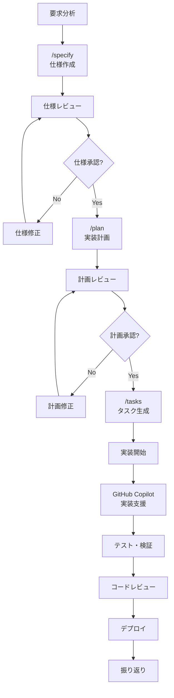

# 開発プロセスガイドライン

> **GitHub Copilot と Spec Kit を活用した仕様駆動開発のワークフロー**

このドキュメントでは、GitHub Copilot と Spec Kit を使用した仕様駆動開発の具体的なプロセスと各フェーズでの作業内容を詳しく説明します。

## 📋 目次

1. [仕様駆動開発とは](#仕様駆動開発とは)
2. [開発フロー概要](#開発フロー概要)
3. [フェーズ別詳細](#フェーズ別詳細)
4. [GitHub Copilot 統合](#github-copilot-統合)
5. [品質管理](#品質管理)
6. [レビュープロセス](#レビュープロセス)
7. [ベストプラクティス](#ベストプラクティス)

## 📖 仕様駆動開発とは

### 基本概念

仕様駆動開発（Spec-Driven Development）は、明確な仕様書を起点として開発を進める手法です。GitHub Copilot との組み合わせにより、以下の利点があります：

- **一貫性**: 仕様書に基づく統一されたコード生成
- **効率性**: 自動化されたコード生成による開発速度向上
- **品質**: 仕様に準拠した実装の保証
- **保守性**: 明確なドキュメントによる長期保守の容易さ

### 従来の開発との比較

| 項目 | 従来の開発 | 仕様駆動開発 |
|------|------------|-------------|
| 開始点 | 要求・アイデア | 構造化された仕様書 |
| 設計 | 暗黙的・断片的 | 明示的・体系的 |
| 実装 | 試行錯誤的 | 計画的・段階的 |
| 品質保証 | 事後チェック | 仕様準拠チェック |
| ドキュメント | 実装後作成 | 実装前に完成 |

## 🔄 開発フロー概要

### 基本フロー



### 各段階の成果物

| フェーズ | 成果物 | 品質指標 |
|---------|--------|----------|
| 要求分析 | 要求仕様書 | 完全性・明確性 |
| 仕様作成 | `spec.md` | Constitution 準拠 |
| 実装計画 | `plan.md` | 実現可能性・完全性 |
| タスク生成 | `tasks.md` | 具体性・実装可能性 |
| 実装 | ソースコード | テストカバレッジ・品質 |
| 検証 | テスト結果 | 仕様適合性 |

## 📝 フェーズ別詳細

### フェーズ 1: 要求分析

#### 目的
- ステークホルダーの要求を明確化
- 実装範囲の確定
- 制約条件の特定

#### 作業内容

1. **要求収集**
   ```markdown
   ## 要求の例
   - 機能要求: ユーザー認証システムが必要
   - 非機能要求: 同時接続1000人対応
   - 制約: Node.js + TypeScript で実装
   - 期限: 2週間以内にMVP完成
   ```

2. **要求の整理**
   - 機能要求の優先順位付け
   - 非機能要求の具体化
   - 技術制約の明確化

3. **受け入れ条件の定義**
   ```markdown
   ## 受け入れ条件
   - [ ] ユーザーはメールアドレスでログインできる
   - [ ] パスワードは8文字以上の制限がある
   - [ ] ログイン状態は24時間維持される
   - [ ] APIレスポンス時間は100ms以下
   ```

#### 成功指標
- 要求の曖昧さが排除されている
- 実装可能な粒度まで分解されている
- 検証可能な受け入れ条件が定義されている

### フェーズ 2: 仕様作成 (`/specify`)

#### 目的
- 要求を技術的に実装可能な仕様に変換
- アーキテクチャの基本設計
- データモデル・API設計

#### 作業手順

1. **GitHub Copilot での仕様生成**
   ```bash
   /specify
   ユーザー認証システムを実装したい。
   
   要件:
   - JWT ベースの認証
   - メール・パスワードでのログイン
   - Node.js + TypeScript + Express
   - PostgreSQL + Prisma
   - Redis でセッション管理
   
   非機能要求:
   - 同時接続 1000人対応
   - レスポンス時間 100ms以下
   - HTTPS 必須
   ```

2. **生成された仕様の確認項目**
   ```markdown
   ## チェックリスト
   - [ ] 機能要件が網羅されている
   - [ ] 非機能要件が具体化されている
   - [ ] アーキテクチャが妥当
   - [ ] データモデルが適切
   - [ ] API仕様が明確
   - [ ] セキュリティ要件が含まれている
   - [ ] テスト戦略が記載されている
   ```

3. **Constitution チェック**
   ```bash
   # 自動チェック実行
   uvx --from git+https://github.com/github/spec-kit.git specify validate spec.md
   ```

#### 仕様書の構成例

```markdown
# ユーザー認証システム仕様書

## 概要
JWT ベースのユーザー認証システムを実装する。

## 機能要件

### 1. ユーザー登録
- メールアドレス・パスワードでの新規登録
- メール認証による本人確認
- パスワード強度チェック

### 2. ログイン・ログアウト
- メールアドレス・パスワードでのログイン
- JWT トークンの発行
- リフレッシュトークンによる自動更新

## アーキテクチャ

### システム構成
```
Frontend (React) 
    ↓ HTTPS
API Gateway (Express.js)
    ↓
Authentication Service
    ↓
Database (PostgreSQL) + Cache (Redis)
```

### データモデル
```typescript
interface User {
  id: string
  email: string
  passwordHash: string
  emailVerified: boolean
  createdAt: Date
  updatedAt: Date
}

interface Session {
  id: string
  userId: string
  token: string
  refreshToken: string
  expiresAt: Date
}
```

## API 仕様

### POST /api/auth/register
```json
{
  "email": "user@example.com",
  "password": "SecurePass123"
}
```

### POST /api/auth/login
```json
{
  "email": "user@example.com", 
  "password": "SecurePass123"
}
```

## 非機能要件
- レスポンス時間: 100ms以下
- 可用性: 99.9%
- 同時接続: 1000人
- セキュリティ: HTTPS, CORS, Rate Limiting

## テスト戦略
- Unit Test: 各関数の動作確認
- Integration Test: API エンドポイントの動作確認
- E2E Test: ユーザーシナリオの確認
```

#### 品質チェック

1. **完全性チェック**
   - 全ての機能要件が仕様化されている
   - 非機能要件が具体的数値で記載されている
   - エラーハンドリングが考慮されている

2. **一貫性チェック**
   - データモデルとAPI仕様の整合性
   - アーキテクチャと実装技術の適合性
   - セキュリティ要件の一貫性

3. **実現可能性チェック**
   - 技術的制約との適合性
   - パフォーマンス要件の現実性
   - 開発期間との妥当性

### フェーズ 3: 実装計画作成 (`/plan`)

#### 目的
- 仕様を実装可能な段階に分解
- 開発スケジュールの策定
- リスクの特定と対策

#### 作業手順

1. **計画生成**
   ```bash
   /plan specs/20240915-143000-user-auth/spec.md
   ```

2. **生成された計画の確認**
   ```markdown
   ## 確認項目
   - [ ] 実装順序が論理的
   - [ ] 各フェーズが独立してテスト可能
   - [ ] 依存関係が明確
   - [ ] リスクが特定されている
   - [ ] 工数見積もりが妥当
   ```

#### 実装計画の構成例

```markdown
# ユーザー認証システム実装計画

## フェーズ 1: 基盤構築 (3日)
### 目標
プロジェクトの基本構造とデータベース設計を完成させる。

### 作業内容
1. プロジェクト構造の作成
2. 依存関係のセットアップ
3. データベーススキーマの実装
4. 基本的なミドルウェアの設定

### 成果物
- [ ] プロジェクトの雛形
- [ ] package.json と依存関係
- [ ] Prisma スキーマ
- [ ] Express.js 基本設定

### リスク・対策
- **リスク**: データベース設計の複雑化
- **対策**: シンプルなスキーマから開始し、段階的に拡張

## フェーズ 2: 認証API実装 (5日)
### 目標
基本的な認証機能（登録・ログイン）を実装。

### 作業内容
1. ユーザー登録API
2. ログインAPI
3. JWT トークン生成・検証
4. パスワードハッシュ化

### 成果物
- [ ] POST /api/auth/register
- [ ] POST /api/auth/login
- [ ] JWT ミドルウェア
- [ ] パスワード暗号化機能

### テスト
- [ ] Unit Test: 各API の動作確認
- [ ] Integration Test: データベース連携確認

## フェーズ 3: セッション管理 (3日)
### 目標
Redis を使用したセッション管理とリフレッシュトークン機能。

### 作業内容
1. Redis 接続設定
2. セッション管理機能
3. リフレッシュトークン実装
4. ログアウト機能

### 成果物
- [ ] Redis セッションストア
- [ ] POST /api/auth/refresh
- [ ] POST /api/auth/logout
- [ ] セッション期限管理

## フェーズ 4: セキュリティ強化 (2日)
### 目標
本番運用に向けたセキュリティ対策の実装。

### 作業内容
1. CORS 設定
2. Rate Limiting
3. 入力値検証強化
4. セキュリティヘッダー設定

### 成果物
- [ ] CORS ミドルウェア
- [ ] Rate limiting ミドルウェア  
- [ ] バリデーション機能
- [ ] セキュリティヘッダー

## フェーズ 5: テスト・デプロイ (3日)
### 目標
包括的なテストとデプロイメント準備。

### 作業内容
1. E2E テスト作成
2. パフォーマンステスト
3. デプロイメント設定
4. モニタリング設定

### 成果物
- [ ] E2E テストスイート
- [ ] ロードテスト結果
- [ ] Docker 化
- [ ] CI/CD パイプライン

## 総工数・スケジュール
- **総工数**: 16日間
- **開発者**: 2名
- **期間**: 2週間（並行作業あり）
- **バッファ**: 20%（3.2日）

## リスク管理
| リスク | 影響度 | 発生確率 | 対策 |
|--------|--------|----------|------|
| データベース性能問題 | 高 | 中 | 早期の性能テスト実施 |
| セキュリティ脆弱性 | 高 | 低 | セキュリティレビュー強化 |
| 外部ライブラリの問題 | 中 | 低 | 代替ライブラリの事前調査 |
```

### フェーズ 4: タスク生成 (`/tasks`)

#### 目的
- 実装計画を具体的なコーディングタスクに分解
- GitHub Copilot で実装可能な粒度まで細分化
- 並行作業とテストの容易さを考慮

#### 作業手順

1. **タスク生成**
   ```bash
   /tasks specs/20240915-143000-user-auth/plan.md
   ```

2. **タスクの優先順位付け**
   - 依存関係を考慮した順序決定
   - 並行実行可能なタスクの特定
   - クリティカルパスの明確化

#### タスクの構成例

```markdown
# ユーザー認証システム実装タスク

## フェーズ 1: 基盤構築

### タスク 1.1: プロジェクト初期化
**推定時間**: 2時間  
**担当者**: 開発者A  
**依存**: なし

#### 作業内容
- [ ] package.json の作成
- [ ] TypeScript 設定 (tsconfig.json)
- [ ] ESLint + Prettier 設定
- [ ] フォルダ構造の作成

#### 成果物
```
src/
├── controllers/
├── middlewares/
├── models/
├── routes/
├── services/
├── utils/
└── app.ts
```

#### GitHub Copilot 活用
```typescript
// プロンプト例
// Express.js + TypeScript の基本的なアプリケーション構造を作成
// CORS、helmet、morgan ミドルウェアを含む
```

### タスク 1.2: データベース設定
**推定時間**: 3時間  
**担当者**: 開発者B  
**依存**: タスク 1.1

#### 作業内容
- [ ] Prisma の初期化
- [ ] データベーススキーマ定義
- [ ] マイグレーション設定
- [ ] データベース接続確認

#### 成果物
```sql
-- prisma/schema.prisma
model User {
  id            String   @id @default(cuid())
  email         String   @unique
  passwordHash  String
  emailVerified Boolean  @default(false)
  createdAt     DateTime @default(now())
  updatedAt     DateTime @updatedAt
  
  sessions Session[]
  
  @@map("users")
}

model Session {
  id           String   @id @default(cuid())
  userId       String
  token        String   @unique
  refreshToken String   @unique
  expiresAt    DateTime
  createdAt    DateTime @default(now())
  
  user User @relation(fields: [userId], references: [id], onDelete: Cascade)
  
  @@map("sessions")
}
```

#### GitHub Copilot 活用
```typescript
// プロンプト例
// Prisma を使用したユーザー認証のデータベーススキーマ
// User テーブルと Session テーブルのリレーション
// JWT トークンとリフレッシュトークンの管理
```

## フェーズ 2: API実装

### タスク 2.1: ユーザー登録API
**推定時間**: 4時間  
**担当者**: 開発者A  
**依存**: タスク 1.2

#### 作業内容
- [ ] バリデーションスキーマ定義
- [ ] パスワードハッシュ化機能
- [ ] ユーザー作成サービス
- [ ] 登録API エンドポイント

#### 成果物
```typescript
// src/controllers/authController.ts
export const register = async (req: Request, res: Response) => {
  // ユーザー登録処理
}

// src/services/userService.ts
export const createUser = async (userData: CreateUserData) => {
  // ユーザー作成ロジック
}
```

#### テスト
- [ ] 正常系: ユーザー作成成功
- [ ] 異常系: 重複メール、無効パスワード
- [ ] セキュリティ: SQLインジェクション対策

#### GitHub Copilot 活用
```typescript
// プロンプト例
// Express.js でユーザー登録API を実装
// bcrypt でパスワードハッシュ化
// Joi で入力値バリデーション
// Prisma でデータベース操作
```

### タスク 2.2: ログインAPI
**推定時間**: 4時間  
**担当者**: 開発者B  
**依存**: タスク 2.1

#### 作業内容
- [ ] ログイン認証ロジック
- [ ] JWT トークン生成
- [ ] リフレッシュトークン生成
- [ ] セッション作成

#### 成果物
```typescript
// src/services/authService.ts
export const login = async (email: string, password: string) => {
  // ログイン処理
  // JWT + Refresh Token 生成
}

// src/utils/jwt.ts
export const generateTokens = (userId: string) => {
  // JWT ペア生成
}
```

#### GitHub Copilot 活用
```typescript
// プロンプト例
// JWT ベースの認証システム実装
// bcrypt でパスワード照合
// Access Token と Refresh Token の生成
// Redis でセッション管理
```
```

#### タスクの品質指標

1. **粒度の適切性**
   - 1タスクは 2-4時間で完了可能
   - 独立してテスト可能
   - 並行実行可能（依存関係が明確）

2. **具体性**
   - 実装すべき内容が具体的
   - GitHub Copilot プロンプト例が含まれる
   - 期待する成果物が明確

3. **検証可能性**
   - テストケースが定義されている
   - 受け入れ条件が明確
   - 進捗が測定可能

### フェーズ 5: 実装・テスト

#### GitHub Copilot を活用した実装

1. **効果的なプロンプト作成**
   ```typescript
   // 良いプロンプトの例
   // Express.js + TypeScript でREST API を実装
   // JWT 認証ミドルウェアを含む
   // Prisma でデータベース操作
   // エラーハンドリングとバリデーション付き
   
   // 悪いプロンプトの例
   // ログイン機能作って
   ```

2. **段階的な実装**
   ```typescript
   // Step 1: 基本構造の生成
   // Express.js のユーザー認証コントローラーの雛形
   
   // Step 2: 詳細実装
   // JWT トークン生成・検証機能の実装
   
   // Step 3: エラーハンドリング追加
   // 認証エラーのハンドリングとレスポンス
   ```

3. **コードレビュー**
   - 仕様との適合性確認
   - セキュリティチェック
   - パフォーマンス確認
   - テストカバレッジ確認

## 🤖 GitHub Copilot 統合

### 効果的な活用方法

#### 1. コンテキスト最適化

```typescript
// ファイル先頭にコンテキスト情報を記載
/**
 * User Authentication Controller
 * 
 * Features:
 * - JWT-based authentication
 * - User registration with email verification
 * - Login with email/password
 * - Session management with Redis
 * 
 * Dependencies:
 * - Express.js + TypeScript
 * - Prisma ORM
 * - bcrypt for password hashing
 * - jsonwebtoken for JWT
 */
```

#### 2. 段階的詳細化

```typescript
// Level 1: 基本構造
// Express.js authentication middleware

// Level 2: 具体的機能
// JWT verification middleware with error handling

// Level 3: 詳細実装
// JWT middleware that validates token, checks expiration, 
// and attaches user info to request object
```

#### 3. テスト駆動開発

```typescript
// テストケース先行作成
describe('User Authentication', () => {
  it('should register new user with valid email and password', async () => {
    // GitHub Copilot がテスト実装を生成
  })
})

// テストに基づく実装
// 上記テストを通す実装をGitHub Copilotで生成
```

### Copilot Chat の活用

#### 実装フェーズでの質問例

```
Q: このAPIエンドポイントのエラーハンドリングを改善するには？

Q: JWT トークンの検証でセキュリティを強化したい

Q: Prisma のクエリ性能を最適化する方法は？

Q: このコードのテストケースを作成して
```

#### レビューフェーズでの質問例

```
Q: このコードにセキュリティ脆弱性はある？

Q: パフォーマンスのボトルネックはどこ？

Q: 仕様との整合性をチェックして

Q: エラーハンドリングは十分？
```

## 🔍 品質管理

### Constitution Check

#### 自動チェック項目

```markdown
## プロジェクト憲法チェック
- [ ] 技術スタック準拠: Node.js + TypeScript
- [ ] アーキテクチャパターン: RESTful API
- [ ] セキュリティ要件: HTTPS、認証、認可
- [ ] テスト要件: Unit/Integration/E2E
- [ ] ドキュメント要件: API仕様、README
- [ ] パフォーマンス要件: レスポンス時間制限
```

#### 実行方法

```bash
# 仕様書のチェック
uvx --from git+https://github.com/github/spec-kit.git specify validate specs/*/spec.md

# 実装コードのチェック
uvx --from git+https://github.com/github/spec-kit.git specify check-implementation src/
```

### 品質ゲート

#### フェーズゲート

| フェーズ | 品質ゲート | 通過条件 |
|---------|------------|----------|
| 仕様作成 | Constitution Check | 100% パス |
| 実装計画 | 実現可能性審査 | アーキテクト承認 |
| タスク生成 | 粒度・依存関係チェック | PM 承認 |
| 実装 | コードレビュー | 2名以上承認 |
| テスト | カバレッジ・品質 | 90%以上 |

#### 継続的品質管理

```yaml
# .github/workflows/quality-check.yml
name: Quality Check
on: [push, pull_request]

jobs:
  spec-validation:
    runs-on: ubuntu-latest
    steps:
      - uses: actions/checkout@v3
      - name: Validate Specifications
        run: |
          uvx --from git+https://github.com/github/spec-kit.git specify validate specs/
  
  code-quality:
    runs-on: ubuntu-latest  
    steps:
      - uses: actions/checkout@v3
      - name: ESLint Check
        run: npm run lint
      - name: Test Coverage
        run: npm run test:coverage
```

## 👥 レビュープロセス

### 仕様レビュー

#### 参加者
- **仕様作成者**: 仕様の説明・質問回答
- **アーキテクト**: 技術的妥当性の確認
- **プロダクトオーナー**: ビジネス要件の確認
- **QA**: テスト観点の確認

#### チェック項目

```markdown
## 仕様レビューチェックリスト

### 完全性
- [ ] 全ての機能要件が仕様化されている
- [ ] 非機能要件が具体的数値で記載されている
- [ ] エラーケースが考慮されている
- [ ] セキュリティ要件が含まれている

### 妥当性
- [ ] 技術的に実現可能
- [ ] パフォーマンス要件が現実的
- [ ] 工数・期間が妥当

### 一貫性
- [ ] データモデルとAPI仕様が整合
- [ ] アーキテクチャと技術選択が適合
- [ ] 全体設計との整合性

### 保守性
- [ ] 将来の拡張を考慮
- [ ] ドキュメント化が適切
- [ ] テスト戦略が明確
```

### コードレビュー

#### フォーカス項目

1. **仕様適合性**
   - 仕様書との一致確認
   - 受け入れ条件の満足確認

2. **品質**
   - コード品質（可読性、保守性）
   - セキュリティ
   - パフォーマンス

3. **テスト**
   - テストカバレッジ
   - テストケースの妥当性

#### レビューテンプレート

```markdown
## コードレビュー結果

### 仕様適合性 ✅/❌
- [ ] 仕様書の要件を満たしている
- [ ] 受け入れ条件をクリアしている
- [ ] APIレスポンス形式が仕様通り

### コード品質 ✅/❌
- [ ] 可読性が高い
- [ ] 適切なエラーハンドリング
- [ ] セキュリティ対策が実装されている

### テスト ✅/❌
- [ ] Unit Test でカバーされている
- [ ] Integration Test が通る
- [ ] エッジケースがテストされている

### 改善提案
1. [具体的な改善点]
2. [具体的な改善点]

### 承認状況
- [ ] 承認 (マージ可能)
- [ ] 条件付き承認 (軽微な修正後マージ可能)
- [ ] 要修正 (再レビュー必要)
```

## 🎯 ベストプラクティス

### 仕様作成のベストプラクティス

#### 1. 段階的詳細化

```bash
# Step 1: 概要レベル
/specify システム全体の認証機能

# Step 2: 機能レベル  
/specify ユーザー登録機能の詳細

# Step 3: 技術レベル
/specify JWT トークン管理の実装詳細
```

#### 2. 具体的要求入力

```markdown
# 良い例
要件:
- 技術スタック: Node.js 18+ + TypeScript 4.8+
- データベース: PostgreSQL 14+ (Prisma ORM)
- 認証方式: JWT (アクセストークン15分、リフレッシュトークン7日)
- セッション管理: Redis 6+
- API形式: REST (OpenAPI 3.0準拠)
- テスト: Jest + Supertest (カバレッジ90%以上)
- セキュリティ: HTTPS必須、CORS設定、Rate Limiting

# 悪い例
Node.js で認証システムを作りたい
```

#### 3. Constitution の活用

```markdown
# .specify/constitution.md
## プロジェクト原則
- API First: 実装前にAPI仕様確定
- TDD: テストコード先行開発
- Security by Design: セキュリティを後付けしない
- Performance: レスポンス時間100ms以下
- Monitoring: 全てのAPIにログ・メトリクス

## 技術制約
- 言語: TypeScript のみ
- フレームワーク: Express.js (その他禁止)
- データベース: PostgreSQL (MySQL禁止)
- 認証: JWT のみ (Session 禁止)
```

### GitHub Copilot 活用のベストプラクティス

#### 1. コンテキスト最適化

```typescript
// ファイル構造をコメントで明示
/**
 * Project Structure:
 * src/
 * ├── controllers/  # HTTP request handlers
 * ├── services/     # Business logic
 * ├── repositories/ # Data access layer
 * ├── middlewares/  # Express middlewares
 * └── utils/        # Helper functions
 */

// 現在のファイルの役割を明示
/**
 * AuthController: Handles user authentication endpoints
 * - POST /auth/register: User registration
 * - POST /auth/login: User login
 * - POST /auth/refresh: Token refresh
 * - POST /auth/logout: User logout
 */
```

#### 2. プロンプトパターン

```typescript
// パターン1: 機能実装
// Express.js controller for user authentication
// with JWT token generation and validation

// パターン2: テスト実装  
// Jest unit tests for authentication service
// covering success and error cases

// パターン3: 最適化
// Optimize this database query for better performance
// using Prisma ORM with PostgreSQL

// パターン4: セキュリティ
// Add security enhancements to this authentication endpoint
// including rate limiting and input validation
```

#### 3. 段階的実装

```typescript
// Stage 1: 骨格作成
// Basic Express.js API structure with TypeScript

// Stage 2: 機能追加
// Add JWT authentication middleware with user context

// Stage 3: エラーハンドリング
// Comprehensive error handling for authentication failures

// Stage 4: 最適化
// Performance optimization and security hardening
```

### チーム開発のベストプラクティス

#### 1. 役割分担

```markdown
## チーム役割
- **Spec Owner**: 仕様の一貫性維持、Constitution管理
- **Tech Lead**: アーキテクチャ決定、技術レビュー
- **Developer**: 実装、単体テスト
- **QA**: 品質保証、受け入れテスト
- **DevOps**: インフラ、デプロイメント
```

#### 2. ワークフロー標準化

```bash
# 標準的な開発フロー
1. Issue作成・アサイン
2. /specify で仕様作成
3. 仕様レビュー・承認
4. /plan で実装計画
5. 計画レビュー・承認  
6. /tasks でタスク分解
7. ブランチ作成・実装
8. プルリクエスト・レビュー
9. マージ・デプロイ
10. 振り返り・改善
```

#### 3. ナレッジ管理

```markdown
## ナレッジ蓄積
- **成功パターン**: 効果的な仕様・実装例の保存
- **失敗分析**: 問題の原因と対策の文書化
- **テンプレート改善**: 学習内容の反映
- **メトリクス**: 開発効率・品質の継続測定
```

### 運用フェーズのベストプラクティス

#### 1. 継続的改善

```markdown
## 定期的な見直し
- **週次**: タスク粒度・工数予測の精度確認
- **月次**: 仕様品質・レビュー効率の測定
- **四半期**: Constitution・テンプレートの更新
```

#### 2. メトリクス収集

```bash
# 効率指標
- 要求→仕様変換時間
- 仕様→実装時間  
- レビュー回数・時間
- バグ発見率・修正時間

# 品質指標
- 仕様の完全性スコア
- 実装の仕様適合率
- テストカバレッジ
- 本番障害率
```

#### 3. チーム教育

```markdown
## 教育プログラム
- **新人研修**: 仕様駆動開発の基礎
- **定期研修**: GitHub Copilot活用法
- **ハンズオン**: 実際のプロジェクトで実践
- **知識共有**: 成功事例・失敗事例の共有
```

---

**🎯 効率的で品質の高い仕様駆動開発を実現しましょう！**