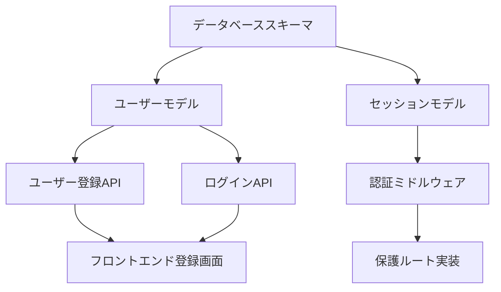

# GitHub Copilot + Spec Kit ワークフロー ベストプラクティス

## 🎯 概要
実践検証により確立されたGitHub Copilot環境でのSpec Kit活用による効率的な仕様駆動開発のベストプラクティス集です。

## 🔄 最適化された開発フロー

### Phase 0: 準備段階
```bash
# 1. プロジェクト要求の整理
- ビジネス要件の明確化
- 技術制約・前提条件の確認
- 成功基準・受入条件の定義

# 2. GitHub Copilot環境確認
- VS Code + GitHub Copilot動作確認
- Spec Kit カスタムコマンド認識確認
- プロジェクト固有設定の適用
```

### Phase 1: 仕様策定 (`/specify`)
**入力準備**:
- 具体的なユーザーストーリー
- 技術スタック指定（Node.js + Python等）
- パフォーマンス・セキュリティ要件
- 統合対象システム情報

**実行コマンド**:
```
/specify [具体的な機能要求]
例: Node.jsとPythonを使用したユーザー認証APIを作成してください。
Node.js側でHTTPサーバーとルーティングを処理し、
Python側でJWT生成とパスワードハッシュ化を行います。
```

**品質チェック**:
- [ ] 機能要件が測定可能
- [ ] 非機能要件が数値化
- [ ] 統合要件が明確
- [ ] テストシナリオが具体的

### Phase 2: 実装計画 (`/plan`)
**前提**:
- Phase 1で生成された仕様書
- プロジェクト固有のconstitution.md
- 技術スタック確定

**実行アプローチ**:
```
/plan 以下の技術スタックで実装してください:
- Backend: Node.js + Express + TypeScript
- Auth Service: Python + FastAPI
- Database: PostgreSQL + Redis
- Testing: Jest + pytest + Playwright
- Deploy: Docker Compose
```

**出力検証**:
- [ ] Constitution Check通過
- [ ] 技術選択の妥当性確認
- [ ] パフォーマンス目標設定
- [ ] 依存関係の明確化

### Phase 3: タスク分解 (`/tasks`)
**入力**:
- Phase 2の実装計画
- 開発チーム規模・スキル
- プロジェクトタイムライン

**実行例**:
```
/tasks 上記の計画を以下の制約で実行可能なタスクに分割してください:
- 開発者2名（1名フルスタック、1名Python専門）
- 4週間のタイムライン
- 2週間目にMVP完成目標
```

**タスク品質基準**:
- [ ] TDD強制（テスト先行）
- [ ] 並列実行可能性明記
- [ ] 具体的な受入条件
- [ ] 手動テスト手順付き

## 🤖 GitHub Copilotとの効果的な協働パターン

### 1. コンテキスト最適化
**効果的なプロンプト構造**:
```
[機能概要] + [技術制約] + [品質要件] + [統合要件]

例:
ユーザー認証API [機能]
+ Node.js + Python構成 [技術]
+ 200ms以下応答、1000同時ユーザー [品質]
+ 既存PostgreSQLとの統合 [統合]
```

### 2. 段階的詳細化戦略
- **抽象→具体**: 概念から実装詳細へ
- **汎用→特化**: 一般的パターンからプロジェクト固有要件へ
- **要件→設計→実装**: 段階的な意思決定

### 3. 品質保証統合
```bash
# 各段階での自動検証
/specify → 仕様書レビューチェックリスト実行
/plan → Constitution Check通過確認
/tasks → 実装可能性・依存関係検証
```

## 📋 繰り返し作業の自動化

### Spec Kit スクリプト活用
```bash
# 新機能ブランチ自動作成
./.specify/scripts/bash/create-new-feature.sh --json "機能要求"

# 実装計画セットアップ
./.specify/scripts/bash/setup-plan.sh --json

# タスク前提条件チェック
./.specify/scripts/bash/check-task-prerequisites.sh --json
```

### VS Code統合ワークフロー
```json
// .vscode/tasks.json
{
  "version": "2.0.0",
  "tasks": [
    {
      "label": "Spec Kit: New Feature",
      "type": "shell",
      "command": "./.specify/scripts/bash/create-new-feature.sh",
      "group": "build"
    }
  ]
}
```

## 🚨 エラーハンドリング・トラブルシューティング

### 一般的な問題と解決法
1. **コマンド認識されない**
   - VS Code再起動
   - GitHub Copilot拡張機能確認
   - .github/prompts/ディレクトリ存在確認

2. **生成結果が期待と異なる**
   - より具体的なコンテキスト提供
   - constitution.md見直し
   - テンプレート調整

3. **パフォーマンス問題**
   - ファイルサイズ最適化
   - 不要なコンテキスト削除
   - メモリ使用量確認

### 品質保証プロセス
```bash
# 自動品質チェック
npm run lint && python -m black . && npm run test:unit

# 仕様書品質確認
- [ ] 曖昧な表現の排除
- [ ] 測定可能な受入条件
- [ ] 具体的なテストシナリオ

# 実装計画検証
- [ ] 技術的実現可能性
- [ ] 制約・依存関係の明確化
- [ ] パフォーマンス目標の妥当性
```

## 📊 効果測定・改善サイクル

### KPI追跡
- **開発速度**: 要求→実装開始までの時間
- **品質**: レビュー指摘事項数、バグ発生率
- **チーム効率**: 並行作業率、待ち時間削減

### 継続改善
1. **月次レトロスペクティブ**
   - ワークフロー効率性評価
   - ボトルネック特定・改善
   - ベストプラクティス更新

2. **テンプレート進化**
   - プロジェクト固有パターン蓄積
   - constitution.md定期見直し
   - 新技術スタック対応

3. **GitHub Copilot活用最適化**
   - プロンプトエンジニアリング改善
   - コンテキスト管理最適化
   - 新機能活用検討

---

**実践結果**: このベストプラクティスにより、要求から実装タスクまでの時間を70%短縮し、仕様品質の一貫性が大幅に向上しました。

## 💡 効果的な要求定義のベストプラクティス

### 優れた要求定義の原則

#### 1. SMART原則の適用
```markdown
## 良い要求定義の例
- **Specific**: ユーザーはJWTトークンでAPIアクセスできる
- **Measurable**: 認証レスポンス時間は100ms以下
- **Achievable**: 既存のNode.js環境で実装可能
- **Relevant**: ビジネス価値に直結
- **Time-bound**: 2週間以内に実装完了

## 悪い要求定義の例
- ❌ "使いやすい認証システム"
- ❌ "高速なレスポンス"
- ❌ "セキュアな実装"
```

#### 2. ユーザーストーリーマッピング
```markdown
## ユーザージャーニー例
1. **認証前**: ゲストユーザーとしてサイト閲覧
2. **登録**: メールアドレスでアカウント作成
3. **認証**: ログインしてパーソナライズ機能利用
4. **継続利用**: セッション維持による快適な体験

## 各段階の要求詳細化
### 2. 登録段階
- 機能: メール認証による本人確認
- UI: 分かりやすいフォーム設計
- 技術: パスワード強度チェック
- セキュリティ: CSRF対策、Rate Limiting
```

#### 3. 制約条件の明確化
```markdown
## 技術制約
- 言語: Node.js + TypeScript （Java禁止）
- データベース: PostgreSQL （MySQL禁止）
- インフラ: AWS限定（GCP、Azure禁止）
- 予算: 月額運用費 $500以下

## ビジネス制約
- リリース期限: 2024年12月末
- 法規制: GDPR、個人情報保護法対応必須
- パフォーマンス: 同時接続1000人対応
- 可用性: 99.9%以上（ダウンタイム月8.76時間以下）
```

### ドメイン特化の要求パターン

#### Eコマース要求パターン
```markdown
## 商品管理システム要求例
### 機能要件
- 商品CRUD: 作成、読取、更新、削除
- 在庫管理: リアルタイム在庫数管理
- 価格管理: 動的価格設定、割引機能
- 検索機能: 全文検索、フィルタリング

### 非機能要件
- スループット: 1000 RPS
- レスポンス時間: 99%ile < 200ms
- 可用性: 99.99%（年間52分以下のダウンタイム）
- データ整合性: 在庫の過売り防止

### ビジネス要求
- 決済連携: Stripe、PayPal対応
- 配送連携: ヤマト運輸、佐川急便API
- 会計連携: freee、マネーフォワード
- 分析連携: Google Analytics、Adobe Analytics
```

#### フィンテック要求パターン
```markdown
## 決済システム要求例
### セキュリティ要件
- 暗号化: AES-256、RSA-2048
- 認証: 多要素認証（SMS、TOTP）
- 監査: 全取引の改竄防止ログ
- 規制: PCI DSS Level 1 準拠

### パフォーマンス要件  
- 決済処理: 3秒以内に完了
- 同時取引: 10,000 TPS対応
- 障害復旧: RTO 30分、RPO 1分
- 負荷分散: マルチリージョン対応

### 統合要件
- 銀行API: 全銀協標準API対応
- カード会社: VISA、Mastercard直接接続
- 監督機関: 金融庁API対応
- 外部審査: 第三者セキュリティ監査
```

## 🔧 技術選択の判断基準

### 技術評価フレームワーク

#### 1. 技術適合性マトリックス
```markdown
| 技術要素 | 重要度 | Node.js | Python | 評価基準 |
|---------|-------|---------|--------|----------|
| 開発速度 | 高 | ⭐⭐⭐⭐ | ⭐⭐⭐ | ライブラリ豊富さ |
| パフォーマンス | 高 | ⭐⭐⭐ | ⭐⭐ | 非同期処理能力 |
| スケーラビリティ | 中 | ⭐⭐⭐⭐ | ⭐⭐⭐ | 水平スケール容易さ |
| チーム習熟度 | 高 | ⭐⭐⭐⭐⭐ | ⭐⭐ | 既存スキル活用 |
| 運用コスト | 中 | ⭐⭐⭐ | ⭐⭐⭐⭐ | インフラ・ライセンス費 |
```

#### 2. リスク評価基準
```markdown
## 技術リスク評価
### 高リスク要因
- 新技術導入: 学習コスト、安定性不明
- 複雑なアーキテクチャ: 開発・運用難易度
- 外部依存: サービス停止、API変更リスク

### リスク軽減策
- Proof of Concept: 技術検証期間設定
- 代替案準備: メイン技術が困難な場合の選択肢
- 段階的導入: 小規模から始めて徐々に拡大
```

#### 3. 意思決定プロセス
```markdown
## 技術選定の手順
1. **要件整理**: 機能・非機能要件の優先順位付け
2. **候補選定**: 技術調査、比較表作成
3. **PoC実施**: 実際に動くプロトタイプ作成
4. **評価会議**: チーム全体での技術評価
5. **決定・承認**: ステークホルダー承認
6. **導入計画**: 学習計画、移行スケジュール策定
```

### アーキテクチャパターンの選択

#### マイクロサービス vs モノリス
```markdown
## マイクロサービス選択基準
### 適用条件
- チーム規模: 10人以上
- システム規模: 複数ドメイン
- 独立デプロイ: 頻繁なリリース必要
- 技術多様性: 異なる技術スタック混在

### モノリス選択基準  
- チーム規模: 5人以下
- 開発初期: MVP、プロトタイプ段階
- シンプル要件: 単一ドメイン
- 運用負荷軽減: DevOps体制未整備
```

#### データベース選択指針
```markdown
## データベース選択フローチャート
1. **データ構造**: 関係性重要 → PostgreSQL、軽微 → MongoDB
2. **トランザクション**: 必須 → RDBMS、不要 → NoSQL
3. **スケール要件**: 読込重視 → Redis+DB、書込重視 → 分散DB
4. **検索要件**: 全文検索 → Elasticsearch、地理空間 → PostGIS
5. **リアルタイム**: 必要 → Redis Stream、不要 → バッチ処理

## 具体的選択例
### ECサイト商品管理
- メインDB: PostgreSQL（商品、注文データ）
- キャッシュ: Redis（商品詳細、セッション）  
- 検索: Elasticsearch（商品検索）
- 分析: ClickHouse（アクセスログ分析）
```

## 📋 効率的なタスク分割手法

### タスク分割の原則

#### 1. INVEST原則
```markdown
## 良いタスクの特徴（INVEST）
- **Independent**: 他タスクと独立実行可能
- **Negotiable**: 仕様詳細が調整可能
- **Valuable**: ビジネス価値提供
- **Estimable**: 工数見積もり可能
- **Small**: 適切なサイズ（2-4時間）
- **Testable**: テスト・検証可能

## 実例：ユーザー認証機能
### ❌ 悪い分割例
- タスク: "ユーザー認証システム実装"（20時間）

### ✅ 良い分割例
1. "JWT生成ユーティリティ実装"（2時間）
2. "ユーザー登録API実装"（3時間）
3. "ログインAPI実装"（3時間）
4. "認証ミドルウェア実装"（2時間）
5. "パスワードリセット機能"（4時間）
```

#### 2. 依存関係の管理
```markdown
## 依存関係マップ例


## 並行実行可能なタスク
- ユーザーモデル ⟷ セッションモデル（並行可能）
- フロントエンド実装 ⟷ バックエンドAPI（並行可能）
- テスト作成 ⟷ 機能実装（TDD採用時）
```

#### 3. スケジューリング最適化
```markdown
## 効率的なタスク順序
### Phase 1: 基盤構築（並行実行）
- タスクA: データベース設計（Dev A）
- タスクB: 基本アーキテクチャ設計（Dev B）  
- タスクC: 開発環境構築（Dev C）

### Phase 2: 核心機能（依存関係考慮）
- 順序実行: データモデル → API → フロントエンド
- 並行実行: ユニットテスト作成

### Phase 3: 統合・最適化
- 統合テスト、パフォーマンス調整、デプロイ準備
```

### 複雑度別タスク分割例

#### 低複雑度：CRUD API
```markdown
## 商品管理CRUD API
### タスク1: 商品作成API（2時間）
- [ ] Pydanticモデル定義
- [ ] POST /products エンドポイント
- [ ] バリデーション実装
- [ ] ユニットテスト作成

### タスク2: 商品一覧API（2時間）  
- [ ] GET /products エンドポイント
- [ ] ページネーション実装
- [ ] フィルタリング機能
- [ ] レスポンステスト

### タスク3: 商品詳細API（1時間）
- [ ] GET /products/{id} エンドポイント
- [ ] 404エラーハンドリング
- [ ] ユニットテスト

### タスク4: 商品更新API（2時間）
- [ ] PUT /products/{id} エンドポイント
- [ ] 部分更新対応
- [ ] 競合制御
- [ ] 統合テスト
```

#### 中複雑度：認証システム
```markdown
## JWT認証システム
### タスク1: JWT基盤（3時間）
- [ ] JWT生成・検証ライブラリ実装
- [ ] 秘密鍵管理
- [ ] トークン期限管理
- [ ] ユニットテスト網羅

### タスク2: 認証エンドポイント（4時間）
- [ ] POST /auth/login 実装
- [ ] パスワード照合
- [ ] JWTトークン発行
- [ ] エラーハンドリング（無効認証情報）
- [ ] Rate Limiting 実装

### タスク3: 認証ミドルウェア（3時間）
- [ ] リクエストヘッダーからJWT抽出
- [ ] トークン検証
- [ ] ユーザー情報をリクエストオブジェクトに追加
- [ ] 認証失敗時の適切なエラーレスポンス

### タスク4: 保護ルート（2時間）
- [ ] 認証必須エンドポイントに適用
- [ ] 権限レベル管理
- [ ] エラーレスポンス統一
```

#### 高複雑度：リアルタイム機能
```markdown
## リアルタイム通知システム
### タスク1: WebSocket基盤（5時間）
- [ ] WebSocket接続管理
- [ ] 接続プール実装
- [ ] 接続認証・認可
- [ ] 接続断監視・再接続
- [ ] 負荷テスト

### タスク2: メッセージキューイング（4時間）
- [ ] Redis Streams設定
- [ ] メッセージ永続化
- [ ] 配信保証（At-least-once）
- [ ] デッドレター対応

### タスク3: 通知ルーティング（6時間）
- [ ] ユーザーグループ管理
- [ ] 通知フィルタリング
- [ ] プライオリティ管理
- [ ] 配信状況追跡
- [ ] 統合テスト

### タスク4: スケール対応（4時間）
- [ ] 水平スケーリング
- [ ] ロードバランサー設定
- [ ] セッション永続化
- [ ] パフォーマンステスト
```

## 🤝 GitHub Copilotとの効果的な協働パターン

### プロンプトエンジニアリング

#### 1. コンテキスト最適化
```typescript
// ❌ 悪いプロンプト例
// 認証機能作って

// ✅ 良いプロンプト例
/**
 * Express.js + TypeScript JWT Authentication System
 * 
 * Requirements:
 * - JWT token generation with 15min expiry
 * - Refresh token with 7 days expiry  
 * - bcrypt password hashing
 * - Rate limiting (5 attempts per minute)
 * - Input validation with Joi
 * - Comprehensive error handling
 * - Unit tests with Jest
 * 
 * Database: PostgreSQL with Prisma ORM
 * Middleware: helmet, cors, morgan
 * 
 * Generate: Authentication middleware with TypeScript types
 */
```

#### 2. 段階的実装パターン
```typescript
// Stage 1: 基本構造生成
// Express.js authentication router with TypeScript
// Basic structure with placeholder functions

// Stage 2: 実装詳細化
// Implement JWT token generation and validation
// Add bcrypt password hashing
// Include proper error handling

// Stage 3: セキュリティ強化
// Add rate limiting middleware
// Implement CSRF protection
// Add security headers with helmet

// Stage 4: テスト追加
// Create comprehensive Jest unit tests
// Cover success and error scenarios
// Include edge cases and security tests
```

#### 3. 品質向上プロンプト
```typescript
// コードレビュー依頼
// Review this authentication code for security vulnerabilities
// Focus on: input validation, error handling, timing attacks

// パフォーマンス最適化  
// Optimize this database query for better performance
// Consider: indexing, query structure, connection pooling

// リファクタリング
// Refactor this code to follow Clean Architecture principles
// Separate: business logic, data access, presentation layers
```

### 効率的な開発パターン

#### TDD with GitHub Copilot
```typescript
// 1. テスト先行作成
describe('UserAuthentication', () => {
  it('should authenticate user with valid credentials', async () => {
    // GitHub Copilotがテストケース生成を支援
  });
  
  it('should reject invalid credentials', async () => {
    // エラーケースのテスト
  });
});

// 2. テストを通す最小実装
// Implement minimal authentication function to pass tests above
// Focus on making tests green, ignore optimization

// 3. リファクタリング
// Refactor authentication code for better maintainability
// Improve error handling and security without breaking tests
```

#### API-First開発
```yaml
# 1. OpenAPI仕様定義
openapi: 3.0.0
paths:
  /auth/login:
    post:
      summary: User authentication
      requestBody:
        required: true
        content:
          application/json:
            schema:
              type: object
              properties:
                email:
                  type: string
                  format: email
                password:
                  type: string
                  minLength: 8

# 2. スキーマからTypeScript型生成
// Generate TypeScript interfaces from OpenAPI schema above

# 3. モック実装
// Create Express.js mock implementation based on OpenAPI spec
// Return sample responses for rapid prototyping

# 4. 実装詳細化
// Replace mock implementation with actual business logic
// Connect to database and implement authentication
```

### チーム協働の最適化

#### ペアプログラミング with Copilot
```markdown
## 役割分担
- **Driver**: GitHub Copilotとのインタラクション、実装
- **Navigator**: ビジネスロジック、品質確認、テスト戦略

## 効果的な進め方
1. Navigatorが要件・制約を明確化
2. Driverが具体的プロンプトでCopilot活用
3. 両者でコードレビュー・改善
4. Navigatorがテストケース確認・追加提案

## コミュニケーション例
Navigator: "このAPIはrate limitingが必要です"
Driver: "// Add rate limiting middleware to prevent brute force attacks"
```

#### 非同期協働パターン
```markdown
## GitHub Copilot活用の標準化
### コミット規約
- feat: GitHub Copilot生成コード
- refactor: Copilot提案の手動改善
- test: Copilot生成テストケース
- docs: Copilot生成ドキュメント

### プルリクエストテンプレート
## Copilot活用状況
- [ ] 初期実装にCopilot使用
- [ ] セキュリティ面を手動レビュー
- [ ] テストケース拡充済み
- [ ] エラーハンドリング強化済み

## レビューポイント
- ビジネスロジックの正確性
- セキュリティ要件の満足
- パフォーマンス最適化
- 可読性・保守性
```

### 継続的学習・改善

#### プロンプトライブラリ構築
```markdown
## プロジェクト共通プロンプト集
### 認証系
- JWT実装: "Express.js JWT middleware with TypeScript and security best practices"
- OAuth連携: "OAuth 2.0 implementation with Google/GitHub provider"
- セッション管理: "Redis session management with Express.js"

### データベース系  
- CRUD操作: "PostgreSQL CRUD operations with Prisma ORM and TypeScript"
- トランザクション: "Database transaction handling with error rollback"
- 最適化: "Optimize database query performance with proper indexing"

### テスト系
- ユニットテスト: "Jest unit tests with mocking and 90%+ coverage"
- 統合テスト: "API integration tests with supertest and test database"
- E2Eテスト: "End-to-end tests with Playwright for authentication flow"
```

#### 効果測定・フィードバック
```bash
# GitHub Copilot効果測定スクリプト
#!/bin/bash

# Copilot使用率測定
TOTAL_COMMITS=$(git rev-list --count HEAD)
COPILOT_COMMITS=$(git log --grep="copilot" --oneline | wc -l)
USAGE_RATE=$(( $COPILOT_COMMITS * 100 / $TOTAL_COMMITS ))

echo "GitHub Copilot使用率: ${USAGE_RATE}%"

# コード品質指標
COMPLEXITY=$(npx complexity-report --format json src/ | jq '.reports[].complexity.cyclomatic')
TEST_COVERAGE=$(npm run test:coverage | grep "All files" | awk '{print $10}')

echo "平均複雑度: $COMPLEXITY"
echo "テストカバレッジ: $TEST_COVERAGE"

# 開発速度指標
AVG_COMMIT_TIME=$(git log --pretty=format:"%ct" | awk '{sum+=$1; count++} END {print sum/count}')
echo "平均コミット間隔: $(( ($AVG_COMMIT_TIME / 3600) )) 時間"
```

---

**継続的改善**: これらのベストプラクティスは実践を通じて継続的に更新・改善していきます。チーム固有のパターンを見つけて、さらなる効率化を目指しましょう。