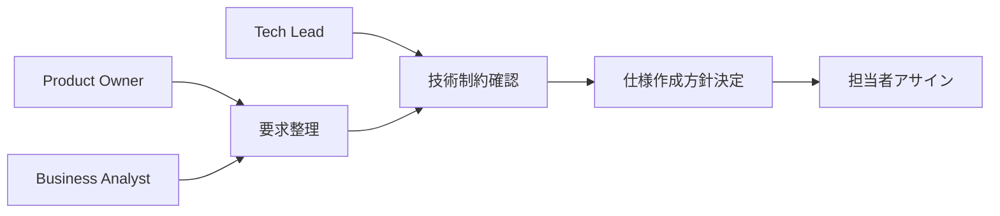
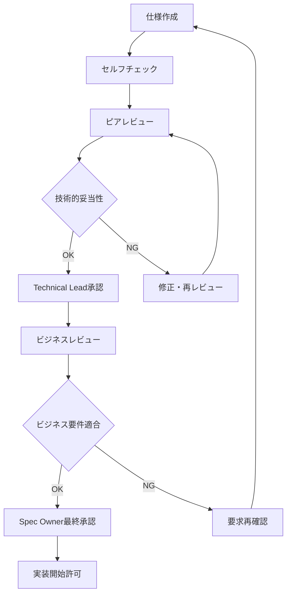

# チーム開発ガイドライン

> **GitHub Copilot + Spec Kit を活用したチーム仕様駆動開発の包括的ガイド**

このガイドラインでは、複数の開発者がSpec Kitを使用して効率的に協働するための方法、レビュープロセス、ナレッジ共有、プロジェクト管理との統合について詳しく説明します。

## 📋 目次

1. [チーム構成と役割](#チーム構成と役割)
2. [コラボレーションワークフロー](#コラボレーションワークフロー)
3. [レビュープロセス](#レビュープロセス)
4. [ナレッジ管理](#ナレッジ管理)
5. [プロジェクト管理統合](#プロジェクト管理統合)
6. [品質保証](#品質保証)
7. [運用・改善サイクル](#運用改善サイクル)

## 👥 チーム構成と役割

### 基本的な役割定義

#### 1. Spec Owner (仕様責任者)
**責任範囲:**
- プロジェクト全体の仕様一貫性維持
- Constitution.md の策定・更新
- 仕様レビューの最終承認
- 技術選定の方向性決定

**日常業務:**
```markdown
## 週次作業
- [ ] 新規仕様書のレビュー・承認
- [ ] Constitution.md の更新検討
- [ ] 技術標準の見直し
- [ ] チーム間の仕様整合性確認

## 月次作業
- [ ] 仕様品質メトリクスの確認
- [ ] ベストプラクティスの更新
- [ ] 新技術導入の検討・判断
- [ ] チーム研修計画の策定
```

**必要スキル:**
- システム全体のアーキテクチャ理解
- ビジネス要件の技術翻訳能力
- コードレビュー・設計レビュー経験
- GitHub Copilot + Spec Kit の深い理解

#### 2. Technical Lead (技術リーダー)
**責任範囲:**
- アーキテクチャ設計・レビュー
- 複雑な技術問題の解決
- 実装計画の妥当性検証
- チームの技術力向上支援

**GitHub Copilot活用方法:**
```typescript
// アーキテクチャ検証プロンプト例
// Review this microservices architecture for scalability issues
// Focus on: data consistency, service boundaries, communication patterns

// パフォーマンス最適化
// Optimize this API endpoint for high throughput
// Consider: caching strategies, database optimization, async processing

// セキュリティレビュー
// Analyze this authentication system for security vulnerabilities
// Check: input validation, session management, encryption standards
```

#### 3. Developer (開発者)
**責任範囲:**
- 日常的な仕様作成・実装
- コードレビューへの参加
- ユニットテスト・統合テストの作成
- ベストプラクティスの実践・フィードバック

**効果的なワークフロー:**
```bash
# 1. 機能要求の分析
/specify [具体的要求の詳細化]

# 2. 仕様レビュー依頼
git add specs/new-feature/spec.md
git commit -m "spec: Add user notification system specification"
# PR作成、Spec Ownerにレビュー依頼

# 3. 承認後の実装計画
/plan specs/new-feature/spec.md

# 4. タスク分解・実装
/tasks specs/new-feature/plan.md
# 個別タスクを実装、GitHub Copilot活用
```

#### 4. QA Engineer (品質保証エンジニア)
**責任範囲:**
- 仕様の検証可能性確認
- テスト戦略・計画の策定
- 受け入れテストの実行
- 品質メトリクスの測定・改善

**仕様レビューでの確認項目:**
```markdown
## QA観点でのチェックリスト
### テスト可能性
- [ ] 受け入れ条件が明確・測定可能
- [ ] エラーケースが網羅されている
- [ ] パフォーマンス要件が具体的数値

### テスト戦略
- [ ] ユニットテスト範囲が適切
- [ ] 統合テストシナリオが現実的
- [ ] E2Eテストの自動化が可能

### 品質要件
- [ ] セキュリティ要件が満たされている
- [ ] 可用性・信頼性要件が明確
- [ ] ユーザビリティ要件が考慮されている
```

### チーム規模別の構成例

#### 小規模チーム (3-5名)
```markdown
## 役割の兼任パターン
- **Spec Owner + Technical Lead**: 1名
- **Developer**: 2-3名（仕様作成も担当）
- **QA**: 1名（開発者が兼任可能）

## 意思決定プロセス
- 仕様: Spec Owner の単独判断
- 技術選定: チーム全体での協議
- 実装方針: Technical Lead の決定
```

#### 中規模チーム (6-15名)
```markdown
## 専門化された役割
- **Spec Owner**: 1名
- **Technical Lead**: 2名（フロント・バック分担）
- **Senior Developer**: 3-4名
- **Developer**: 6-8名
- **QA Engineer**: 2名

## 意思決定プロセス
- 仕様: Spec Owner + Technical Lead 合議
- アーキテクチャ: Technical Lead 会議
- 実装: チームリーダー判断
```

#### 大規模チーム (16名以上)
```markdown
## 階層化された組織
- **Chief Architect**: 1名（全体アーキテクチャ）
- **Spec Owner**: 2-3名（ドメイン別）
- **Technical Lead**: 4-6名（チーム別）
- **Team Lead**: 6-8名（機能別チーム）
- **Developer**: 複数名
- **QA Team**: 専門チーム

## ガバナンス体制
- アーキテクチャ委員会（技術方針決定）
- 仕様審査会（重要仕様の承認）
- 品質委員会（品質基準・プロセス改善）
```

## 🔄 コラボレーションワークフロー

### 仕様駆動開発のチームワークフロー

#### 1. 要求分析フェーズ

**ステークホルダー参加型ワークショップ:**


**要求分析テンプレート:**
```markdown
# 要求分析シート
## ビジネス要求
- **目的**: [ビジネス価値・解決したい問題]
- **ユーザー**: [対象ユーザー・ペルソナ]
- **成功基準**: [測定可能な成果指標]

## 機能要求
- **必須機能**: [MVP に含む機能]
- **重要機能**: [フェーズ2で追加]
- **将来機能**: [長期的な拡張計画]

## 制約条件
- **技術制約**: [使用技術・禁止技術]
- **期限制約**: [リリース期限・マイルストーン]
- **リソース制約**: [予算・人員・インフラ]

## 担当者
- **仕様作成**: [Developer/Spec Owner]
- **技術レビュー**: [Technical Lead]
- **ビジネスレビュー**: [Product Owner]
```

#### 2. 協働仕様作成

**ペア仕様作成 (Pair Specification):**
```markdown
## 役割分担
- **Primary**: GitHub Copilot操作、ドキュメント作成
- **Secondary**: ビジネスロジック確認、品質チェック

## セッション進行
1. **要求理解** (15分): 両者で要求内容を確認
2. **仕様作成** (45分): Primary が `/specify` 実行
3. **レビュー** (30分): Secondary が詳細確認
4. **改善** (30分): 協議して仕様を調整

## 成果物
- [ ] 仕様書 (spec.md)
- [ ] レビューコメント
- [ ] 改善点リスト
- [ ] 次ステップの合意
```

**非同期協働パターン:**
```bash
# 1. 仕様作成者 (Developer A)
/specify [詳細な要求記述]
git add specs/feature-x/spec.md
git commit -m "spec: Add initial specification for feature X"
git push origin feature/spec-feature-x

# 2. レビュー者 (Technical Lead)
# GitHub で仕様をレビュー、コメント追加
# 修正提案: "セキュリティ要件の詳細化が必要"

# 3. 修正 (Developer A)  
# フィードバックを元に仕様を改善
git add specs/feature-x/spec.md
git commit -m "spec: Address security requirements feedback"

# 4. 最終承認 (Spec Owner)
# GitHub PR レビューで承認
```

#### 3. 実装計画の協働作成

**プランニングセッション:**
```markdown
## 参加者
- Spec Owner: 仕様の意図説明
- Technical Lead: アーキテクチャ方針
- Senior Developer: 実装詳細
- QA Engineer: テスト観点

## アジェンダ (90分)
1. **仕様確認** (20分): 全員で仕様書を読み合わせ
2. **計画作成** (30分): `/plan` 実行、基本計画生成
3. **詳細検討** (30分): フェーズ分割、依存関係整理
4. **リスク分析** (10分): 技術リスク、スケジュールリスク特定

## 成果物
- [ ] 実装計画書 (plan.md)
- [ ] リスク・対策一覧
- [ ] 担当者アサイン計画
- [ ] 次回プランニングの日程
```

**分散チーム対応:**
```markdown
## リモート協働ツール活用
### 同期作業
- **VS Code Live Share**: リアルタイム共同編集
- **Zoom + 画面共有**: GitHub Copilot 実行の共有
- **Miro/Figma**: アーキテクチャ図の協働作成

### 非同期作業
- **GitHub Discussions**: 仕様に関する議論
- **Slack Threads**: クイックな質問・回答
- **Loom**: 複雑な説明の動画共有

## タイムゾーン考慮
- 重要な意思決定: 全員参加可能な時間に設定
- 日常的なレビュー: 24時間以内の非同期レスポンス
- 緊急対応: 各地域のオンコール担当者設定
```

### タスク分割での協働

#### 並行作業の最大化

**依存関係マトリックス例:**
```markdown
| タスク | 依存元 | 担当者 | 開始可能時期 |
|--------|--------|--------|-------------|
| データベース設計 | - | Dev A | 即座 |
| API仕様策定 | DB設計 | Dev B | DB設計完了後 |
| フロントエンド設計 | API仕様 | Dev C | API仕様完了後 |
| 認証基盤 | - | Dev D | 即座（並行） |
| テスト計画 | - | QA | 即座（並行） |

## 並行実行可能な組み合わせ
- Group 1: DB設計 + 認証基盤 + テスト計画
- Group 2: API仕様 + フロントエンド基盤
- Group 3: 統合テスト + デプロイ準備
```

**作業進捗の可視化:**
```markdown
## GitHub Project Board活用
### カラム構成
1. **Backlog**: 未着手タスク
2. **In Progress**: 実装中（担当者明記）
3. **Review**: コードレビュー待ち
4. **Testing**: QA検証中
5. **Done**: 完了

### ラベル活用
- `priority:high/medium/low`: 優先度
- `type:spec/plan/tasks/impl`: 作業種別
- `team:frontend/backend/qa`: 担当チーム
- `size:S/M/L/XL`: 作業規模
```

## 👀 レビュープロセス

### 多段階レビューシステム

#### 1. 仕様レビュー

**レビュー段階:**


**レビューチェックリスト:**
```markdown
## セルフチェック (作成者)
### 完全性
- [ ] 全ての機能要件が記載されている
- [ ] 非機能要件が数値化されている
- [ ] エラーケース・例外処理が考慮されている
- [ ] 外部システム連携が明記されている

### 明確性  
- [ ] 曖昧な表現が排除されている
- [ ] 技術用語が正確に使用されている
- [ ] 図表で分かりやすく説明されている
- [ ] 受け入れ条件が測定可能

### 一貫性
- [ ] プロジェクト全体のアーキテクチャと整合
- [ ] Constitution.md の原則に準拠
- [ ] 既存仕様との矛盾が無い
- [ ] 命名規則が統一されている

## ピアレビュー (同僚開発者)
### 実装可能性
- [ ] 技術的に実現可能
- [ ] 既存システムとの統合が容易
- [ ] パフォーマンス要件が現実的
- [ ] 開発期間が妥当

### 保守性
- [ ] 将来の拡張を考慮した設計
- [ ] テストしやすい構造
- [ ] ドキュメント化が適切
- [ ] 運用・監視の考慮

## Technical Lead レビュー
### アーキテクチャ適合性
- [ ] システム全体のアーキテクチャに適合
- [ ] セキュリティ要件が満たされている
- [ ] スケーラビリティが考慮されている
- [ ] 技術的負債の増加を抑制

### 技術標準準拠
- [ ] コーディング規約に準拠
- [ ] ライブラリ・フレームワーク選択が適切
- [ ] API設計がRESTful/GraphQL標準に準拠
- [ ] データベース設計が最適化されている
```

#### 2. 実装レビュー

**段階的レビューアプローチ:**
```markdown
## Phase 1: 設計レビュー (実装前)
### 目的
実装開始前に設計の妥当性を確認し、大きな方向性の誤りを防ぐ

### レビュー項目
- [ ] アーキテクチャ図の妥当性
- [ ] データモデルの正規化・最適化
- [ ] API仕様の一貫性
- [ ] セキュリティ設計の適切性

### 参加者
- 実装担当者 (設計説明)
- Technical Lead (アーキテクチャ承認)
- Senior Developer (実装観点)
- QA Engineer (テスト観点)

## Phase 2: 実装レビュー (PR単位)
### GitHub PR テンプレート
```markdown
## 変更概要
- [ ] 実装した機能
- [ ] 変更したファイル数・行数
- [ ] 追加した依存関係

## 仕様適合性
- [ ] 仕様書の要件を満たしている
- [ ] 受け入れ条件をクリアしている
- [ ] エラーハンドリングが実装されている

## 品質チェック
- [ ] ユニットテストでカバーされている (90%+)
- [ ] 統合テストが通る
- [ ] セキュリティチェックが完了
- [ ] パフォーマンステストが完了

## GitHub Copilot 活用状況
- [ ] 初期実装で Copilot を活用
- [ ] セキュリティ面を手動で強化
- [ ] エラーハンドリングを追加実装
- [ ] テストケースを Copilot で生成・拡充

## レビュー依頼
- [ ] コード品質 (@technical-lead)
- [ ] セキュリティ (@security-team) 
- [ ] パフォーマンス (@performance-team)
- [ ] UI/UX (@design-team)
```

#### 3. 品質ゲートシステム

**自動化された品質チェック:**
```yaml
# .github/workflows/quality-gate.yml
name: Quality Gate
on:
  pull_request:
    types: [opened, synchronize]

jobs:
  spec-validation:
    runs-on: ubuntu-latest
    steps:
      - name: Validate Specification
        run: |
          uvx --from git+https://github.com/github/spec-kit.git specify validate specs/
          
  code-quality:
    runs-on: ubuntu-latest
    steps:
      - name: ESLint Check
        run: npm run lint
      - name: TypeScript Check  
        run: npm run type-check
      - name: Security Scan
        run: npm audit
        
  test-coverage:
    runs-on: ubuntu-latest
    steps:
      - name: Unit Tests
        run: npm run test:unit
      - name: Coverage Report
        run: npm run test:coverage
      - name: Coverage Gate
        run: |
          COVERAGE=$(npm run test:coverage | grep "All files" | awk '{print $10}' | sed 's/%//')
          if [ $COVERAGE -lt 90 ]; then
            echo "Coverage $COVERAGE% is below 90% threshold"
            exit 1
          fi
          
  integration-tests:
    runs-on: ubuntu-latest
    steps:
      - name: API Tests
        run: npm run test:api
      - name: E2E Tests
        run: npm run test:e2e
```

**手動品質ゲート:**
```markdown
## リリース前チェックリスト
### 技術品質
- [ ] 全自動テストが通る
- [ ] セキュリティスキャンがクリア
- [ ] パフォーマンステストが合格
- [ ] アクセシビリティテストが合格

### ビジネス品質
- [ ] 受け入れテストが完了
- [ ] ユーザビリティテストが合格
- [ ] ステークホルダー承認が完了
- [ ] ドキュメントが更新されている

### 運用準備
- [ ] デプロイ手順が確認されている
- [ ] 監視・アラートが設定されている
- [ ] ロールバック手順が準備されている
- [ ] 障害対応手順が文書化されている
```

## 📚 ナレッジ管理

### チーム学習の仕組み

#### 1. 仕様ナレッジベース

**仕様パターンライブラリ:**
```markdown
## 機能別パターン集
### 認証システム
- **基本認証**: JWT + リフレッシュトークン
- **ソーシャル認証**: OAuth 2.0 + OpenID Connect
- **多要素認証**: SMS + TOTP + WebAuthn
- **企業認証**: SAML + LDAP統合

### API設計
- **REST API**: Richardson成熟度モデル Level 3
- **GraphQL**: スキーマファースト設計
- **WebSocket**: リアルタイム通信
- **gRPC**: マイクロサービス間通信

### データ管理
- **CRUD操作**: 基本的なデータ操作
- **複雑クエリ**: 検索・フィルタリング・ソート
- **トランザクション**: 整合性保証
- **レプリケーション**: 読み書き分離
```

**成功事例・失敗事例の蓄積:**
```markdown
# 仕様作成の学習記録

## 成功事例: ユーザー通知システム
### 背景
リアルタイム通知システムの仕様作成で、パフォーマンス要件とユーザー体験の両立を実現

### 工夫した点
1. **段階的詳細化**: 概要 → 機能詳細 → 技術仕様の順で作成
2. **具体的プロンプト**: "/specify WebSocket + Redis を使用したリアルタイム通知"
3. **制約の明確化**: 同時接続1万人、通知遅延100ms以下

### 結果
- 仕様作成時間: 2時間 → 30分に短縮
- 実装での仕様変更: 0件
- 実装期間: 予定通り完了

## 失敗事例: 検索機能仕様
### 背景  
検索機能の仕様が曖昧で、実装中に何度も仕様変更が発生

### 問題点
1. **抽象的な要求**: "使いやすい検索機能"
2. **パフォーマンス要件未定義**: "高速な検索"
3. **エラーケース考慮不足**: 検索結果0件時の処理

### 学習・改善
- 具体的なユーザーシナリオの記載
- 数値化されたパフォーマンス要件
- エッジケース・エラーケースの網羅的検討
```

#### 2. GitHub Copilot 活用ナレッジ

**効果的プロンプト集:**
```typescript
// 【認証系】
// Express.js JWT authentication middleware with TypeScript
// includes rate limiting, input validation, and comprehensive error handling

// 【データベース系】
// PostgreSQL database schema with Prisma ORM
// optimized for read-heavy workload with proper indexing

// 【テスト系】
// Jest integration tests for REST API endpoints
// covers success cases, error cases, and edge cases with 95%+ coverage

// 【セキュリティ系】
// Implement OWASP security best practices for Node.js API
// includes input sanitization, SQL injection prevention, XSS protection

// 【パフォーマンス系】
// Optimize this API endpoint for high throughput
// consider caching strategies, database query optimization, async processing
```

**アンチパターン集:**
```typescript
// ❌ 悪いプロンプト例
// ログイン機能作って
// データベース繋いで  
// エラー処理追加

// ✅ 良いプロンプト例
// Node.js Express.js でJWT認証機能を実装
// 要件: bcryptパスワードハッシュ化、Redisセッション管理、
// rate limiting (5回/分)、包括的エラーハンドリング
// TypeScript型定義とJestテスト含む
```

#### 3. 継続的な学習文化

**学習セッション:**
```markdown
## 月次 Spec Kit Learning Session (2時間)
### アジェンダ
1. **新機能紹介** (30分): Spec Kit の新機能・更新内容
2. **成功事例共有** (30分): 効果的だった仕様作成パターン
3. **課題解決** (45分): 困った事例の共有・解決策検討
4. **ベストプラクティス更新** (15分): ガイドライン改善

### 参加者全員の準備
- [ ] 前月の仕様作成で工夫した点を1つ準備
- [ ] 困った事例・質問を1つ準備
- [ ] GitHub Copilot活用で発見したコツを共有

## 週次 Tech Talk (30分)
### GitHub Copilot活用Tips
- 新しいプロンプトパターンの紹介
- 効率化できた事例の共有
- 注意すべきアンチパターンの紹介
```

**メンタリング制度:**
```markdown
## Buddy System
### 新入社員・新チームメンバー向け
- **Spec Buddy**: 仕様作成の相談相手
- **期間**: 最初の3ヶ月間
- **活動**: 週1回の1on1、実際の仕様作成ペア実践

### 活動内容
1. **Week 1-2**: Spec Kit基本操作の習得
2. **Week 3-4**: 実際の小規模仕様作成を支援
3. **Week 5-8**: 中規模仕様作成、レビュープロセス参加
4. **Week 9-12**: 独立した仕様作成、フィードバック・改善

## Cross-team Learning
### 他チームとの知識交換
- **月1回**: 他チームの仕様事例を学ぶセッション
- **四半期1回**: 技術選定・アーキテクチャ決定プロセスの共有
- **年2回**: 大規模リファクタリング・移行の事例共有
```

## 📊 プロジェクト管理統合

### Issue・タスク管理との連携

#### 1. GitHub Issues 統合

**Issue テンプレート:**
```markdown
## Feature Request
### ビジネス要求
**目的**: [解決したいビジネス課題]
**ユーザー価値**: [ユーザーが得られる価値]
**成功指標**: [測定可能な成果指標]

### 機能要求概要
**核心機能**: [必須で実装したい機能]
**周辺機能**: [あると良い機能]
**将来拡張**: [長期的な発展性]

### 制約・前提条件
**技術制約**: [使用技術・禁止技術]
**期限制約**: [リリース期限・マイルストーン]
**リソース制約**: [予算・人員制約]

### 仕様作成計画
- [ ] 要求分析完了 (期限: )
- [ ] 仕様書作成 (/specify実行) (担当: )
- [ ] 仕様レビュー・承認 (期限: )
- [ ] 実装計画作成 (/plan実行) (担当: )
- [ ] タスク分解 (/tasks実行) (担当: )

### Definition of Done
- [ ] 仕様書が承認されている
- [ ] 実装計画が妥当性確認済み
- [ ] タスクが適切な粒度で分解されている
- [ ] 受け入れ条件が明確に定義されている
```

**Issue ラベル体系:**
```markdown
## 段階別ラベル
- `phase:analysis` - 要求分析中
- `phase:specification` - 仕様作成中  
- `phase:planning` - 実装計画中
- `phase:tasks` - タスク分解中
- `phase:implementation` - 実装中
- `phase:testing` - テスト中
- `phase:done` - 完了

## 優先度ラベル
- `priority:critical` - 緊急対応必要
- `priority:high` - 高優先度
- `priority:medium` - 中優先度
- `priority:low` - 低優先度

## 作業種別ラベル
- `type:feature` - 新機能
- `type:bug` - バグ修正
- `type:enhancement` - 既存機能改善
- `type:refactor` - リファクタリング
- `type:docs` - ドキュメント

## 技術領域ラベル
- `area:frontend` - フロントエンド
- `area:backend` - バックエンド
- `area:database` - データベース
- `area:infrastructure` - インフラ
- `area:security` - セキュリティ
```

#### 2. マイルストーン・スプリント管理

**マイルストーン設計:**
```markdown
## リリース計画との連動
### v1.0.0 - MVP リリース (2024-12-15)
**目標**: 基本機能でユーザー価値提供開始
**含む機能**:
- [ ] ユーザー認証システム
- [ ] 基本的なCRUD操作
- [ ] 最小限のUI

**仕様作成スケジュール**:
- Week 1-2: 全機能の仕様作成・レビュー
- Week 3-4: 実装計画・タスク分解
- Week 5-8: 実装・テスト
- Week 9-10: 統合・リリース準備

### v1.1.0 - 機能拡張 (2025-01-31)
**目標**: ユーザーフィードバックに基づく改善
**含む機能**:
- [ ] 高度な検索・フィルタリング
- [ ] 通知システム
- [ ] ダッシュボード機能

## スプリント連動 (2週間スプリント)
### Sprint Planning での仕様確認
1. **仕様完成度チェック**: 実装予定機能の仕様書・計画・タスクが揃っているか
2. **実装可能性確認**: 技術的な不明点・リスクが解決されているか
3. **受け入れ条件明確化**: QAが検証できる状態になっているか

### Sprint中の仕様変更プロセス
1. **軽微な変更**: チーム内で即座に判断・更新
2. **中規模な変更**: Technical Lead承認後に仕様更新
3. **大規模な変更**: Sprint中止、再プランニング
```

### 外部ツール連携

#### 1. Jira 統合

**自動化スクリプト例:**
```python
# scripts/sync-jira.py
import requests
from pathlib import Path
import re

class JiraSpecSync:
    def __init__(self, jira_url, username, token):
        self.jira_url = jira_url
        self.auth = (username, token)
        
    def create_epic_from_spec(self, spec_path):
        """仕様書からJira Epicを作成"""
        with open(spec_path) as f:
            content = f.read()
            
        title = self.extract_title(content)
        description = self.format_for_jira(content)
        
        epic_data = {
            "fields": {
                "project": {"key": "PROJ"},
                "summary": f"[Spec] {title}",
                "description": description,
                "issuetype": {"name": "Epic"},
                "customfield_10001": self.extract_business_value(content)
            }
        }
        
        response = requests.post(
            f"{self.jira_url}/rest/api/2/issue",
            json=epic_data,
            auth=self.auth
        )
        
        return response.json()
    
    def create_stories_from_tasks(self, tasks_path, epic_key):
        """タスクからJira Storyを作成"""
        with open(tasks_path) as f:
            content = f.read()
            
        tasks = self.parse_tasks(content)
        
        for task in tasks:
            story_data = {
                "fields": {
                    "project": {"key": "PROJ"},
                    "summary": task["title"],
                    "description": task["description"],
                    "issuetype": {"name": "Story"},
                    "customfield_10002": epic_key,  # Epic Link
                    "timetracking": {
                        "originalEstimate": f"{task['estimated_hours']}h"
                    }
                }
            }
            
            requests.post(
                f"{self.jira_url}/rest/api/2/issue",
                json=story_data,
                auth=self.auth
            )

# 使用例
sync = JiraSpecSync("https://company.atlassian.net", "user", "token")

# 新しい仕様書が作成されたらEpicを作成
for spec_file in Path("specs").glob("*/spec.md"):
    epic = sync.create_epic_from_spec(spec_file)
    
    # 対応するタスクファイルがあればStoryを作成
    tasks_file = spec_file.parent / "tasks.md"
    if tasks_file.exists():
        sync.create_stories_from_tasks(tasks_file, epic["key"])
```

#### 2. Slack 通知システム

**仕様進捗の自動通知:**
```python
# scripts/slack-notify.py
import requests
import json
from datetime import datetime

def notify_spec_progress(webhook_url, event_type, spec_path, details):
    """仕様作成の進捗をSlackに通知"""
    
    color_map = {
        "spec_created": "good",        # 緑
        "spec_reviewed": "warning",    # 黄
        "spec_approved": "good",       # 緑
        "plan_created": "#439FE0",     # 青
        "tasks_created": "#9C27B0",    # 紫
        "implementation_started": "#FF9800"  # オレンジ
    }
    
    message = {
        "text": f"📋 仕様進捗更新: {spec_path}",
        "attachments": [
            {
                "color": color_map.get(event_type, "good"),
                "fields": [
                    {
                        "title": "ステータス",
                        "value": details["status"],
                        "short": True
                    },
                    {
                        "title": "担当者",
                        "value": details["assignee"],
                        "short": True
                    },
                    {
                        "title": "次のアクション",
                        "value": details["next_action"],
                        "short": False
                    }
                ],
                "footer": "Spec Kit Notification",
                "ts": int(datetime.now().timestamp())
            }
        ]
    }
    
    requests.post(webhook_url, json=message)

# GitHub Actions から呼び出し例
notify_spec_progress(
    "https://hooks.slack.com/services/...",
    "spec_approved",
    "specs/user-auth/spec.md",
    {
        "status": "仕様承認完了",
        "assignee": "@dev-team",
        "next_action": "実装計画の作成を開始してください"
    }
)
```

## 🎯 品質保証

### チーム品質基準

#### 1. 仕様品質メトリクス

**定量的品質指標:**
```markdown
## 仕様書品質スコア (100点満点)
### 完全性 (30点)
- 機能要件網羅度: 全機能が記載されている (10点)
- 非機能要件明確度: 数値化された要件 (10点)
- エラーケース考慮: 例外処理が網羅 (10点)

### 明確性 (25点)
- 曖昧性排除: "高速"→"100ms以下" (10点)
- 用語統一: プロジェクト用語集準拠 (8点)
- 図表活用: 理解しやすい説明 (7点)

### 実装可能性 (25点)
- 技術的実現性: 現行技術で実装可能 (10点)
- 工数妥当性: 見積もりが現実的 (8点)
- 依存関係明確: 他システムとの関係 (7点)

### 保守性 (20点)
- 拡張性考慮: 将来の機能追加を考慮 (10点)
- テスト容易性: 検証しやすい構造 (10点)

## 品質測定の自動化
```bash
#!/bin/bash
# scripts/measure-spec-quality.sh

SPEC_DIR="specs"
TOTAL_SCORE=0
SPEC_COUNT=0

for spec_file in $(find $SPEC_DIR -name "spec.md"); do
    echo "Analyzing: $spec_file"
    
    # 完全性チェック
    COMPLETENESS=0
    if grep -q "## 機能要件" "$spec_file"; then ((COMPLETENESS+=10)); fi
    if grep -q "## 非機能要件" "$spec_file"; then ((COMPLETENESS+=10)); fi
    if grep -q "## エラーハンドリング" "$spec_file"; then ((COMPLETENESS+=10)); fi
    
    # 明確性チェック  
    CLARITY=0
    # 数値化された要件の存在確認
    if grep -E "[0-9]+ms|[0-9]+%|[0-9]+人" "$spec_file"; then ((CLARITY+=10)); fi
    # 図表の存在確認
    if grep -q "```mermaid\|```plantuml" "$spec_file"; then ((CLARITY+=7)); fi
    
    SPEC_SCORE=$((COMPLETENESS + CLARITY))
    echo "Score: $SPEC_SCORE/100"
    
    TOTAL_SCORE=$((TOTAL_SCORE + SPEC_SCORE))
    ((SPEC_COUNT++))
done

AVG_SCORE=$((TOTAL_SCORE / SPEC_COUNT))
echo "Average Spec Quality Score: $AVG_SCORE/100"

# 品質ゲート
if [ $AVG_SCORE -lt 70 ]; then
    echo "❌ 品質基準未満: 平均スコア70点以上が必要"
    exit 1
else
    echo "✅ 品質基準達成"
fi
```

#### 2. レビュー品質の向上

**レビュー効果測定:**
```markdown
## レビュー効果指標
### 欠陥発見率
- **仕様レビュー**: 実装前に発見した問題数
- **コードレビュー**: 実装後に発見した問題数
- **目標**: 仕様レビューでの発見率 80%以上

### レビュー効率
- **レビュー時間**: 1仕様書あたりの平均レビュー時間
- **修正サイクル**: 承認までの修正回数
- **目標**: 1回の修正で承認率 70%以上

### レビュアー育成
- **新人レビュアー**: 指摘の適切性・建設性
- **ベテランレビュアー**: 後進育成への貢献
- **目標**: 全員が適切なレビューができる状態
```

**レビュアー育成プログラム:**
```markdown
## レビュアー認定制度
### Level 1: 基本レビュアー (入社3ヶ月後)
**認定条件**:
- [ ] Spec Kit基本操作を習得
- [ ] 10件以上の仕様レビュー参加
- [ ] メンターから適切性の承認

**認定後の権限**:
- 機能仕様のピアレビュー
- 簡単な技術選定レビュー

### Level 2: 上級レビュアー (入社1年後)
**認定条件**:
- [ ] 50件以上のレビュー経験
- [ ] アーキテクチャ理解度テスト合格
- [ ] 品質改善提案の実績

**認定後の権限**:
- 複雑な仕様のメインレビュアー
- 新人レビュアーのメンタリング
- レビュープロセス改善への参加

### Level 3: テクニカルリードレビュアー (入社2年後+実績)
**認定条件**:
- [ ] システム全体アーキテクチャの理解
- [ ] 100件以上のレビュー経験
- [ ] 後進育成実績
- [ ] 技術的判断の正確性実績

**認定後の権限**:
- 重要仕様の最終承認
- レビュー基準の策定
- 技術選定の最終判断
```

## 🔄 運用・改善サイクル

### 継続的プロセス改善

#### 1. 定期振り返り

**週次チーム振り返り (30分):**
```markdown
## アジェンダ
1. **今週の仕様作成振り返り** (10分)
   - うまくいった点
   - 困った点・改善点
   - GitHub Copilot活用での発見

2. **プロセス改善アイデア** (15分)
   - 効率化できそうな作業
   - ツール・テンプレートの改善案
   - チーム連携の改善案

3. **来週のアクション決定** (5分)
   - 試してみる改善案
   - 担当者・期限の決定

## 改善アクション例
- Constitution.md の更新
- プロンプトテンプレートの追加
- レビューチェックリストの見直し
- 自動化スクリプトの作成
```

**月次全体振り返り (90分):**
```markdown
## 参加者
- 全チームメンバー
- Technical Lead
- Spec Owner
- QA Engineer

## アジェンダ
1. **メトリクス確認** (20分)
   - 仕様品質スコア
   - レビュー効率指標
   - 実装工数の精度
   - バグ発生率

2. **成功事例・課題の共有** (30分)
   - 効果的だった仕様作成パターン
   - 問題となった事例と原因分析
   - GitHub Copilot活用の成功例

3. **プロセス・ツール改善** (30分)
   - ワークフローの見直し
   - ツール・テンプレートの改善
   - 教育・研修内容の見直し

4. **来月のアクション計画** (10分)
   - 改善施策の決定
   - 担当者・スケジュール確定
```

#### 2. 組織学習の促進

**ナレッジ共有セッション:**
```markdown
## 月次 Tech Share (60分)
### 他チームとの学習交換
1. **仕様作成事例発表** (20分×2チーム)
   - 複雑な要求をどう仕様化したか
   - 技術選定の判断プロセス
   - GitHub Copilot活用の工夫

2. **課題解決事例** (10分×2件)
   - 発生した問題とその解決策
   - 同様の問題の予防策

3. **ツール・プロセス改善事例** (10分)
   - 効率化に成功した改善例
   - 導入してよかったツール・手法

## 四半期 All Hands (120分)
### 全社での知識共有
1. **大規模システム設計事例** (30分)
   - マイクロサービス分割の判断
   - データベース設計の考え方
   - パフォーマンス要件の設定

2. **技術選定の事例研究** (30分)
   - 成功した技術選定とその理由
   - 失敗から学んだ教訓
   - 新技術導入の判断基準

3. **組織・プロセス改善** (30分)
   - チーム規模拡大での課題と対策
   - リモート開発での工夫
   - 新人教育の効果的手法

4. **今後の技術方針** (30分)
   - 来四半期の技術注力分野
   - 新しいツール・手法の導入計画
   - スキル開発目標の設定
```

#### 3. メトリクス駆動改善

**データ収集・分析システム:**
```python
# scripts/collect-metrics.py
import json
import subprocess
from datetime import datetime, timedelta
from pathlib import Path

class SpecMetricsCollector:
    def __init__(self):
        self.metrics = {
            "timestamp": datetime.now().isoformat(),
            "specs": {},
            "team_productivity": {},
            "quality": {}
        }
    
    def collect_spec_metrics(self):
        """仕様関連メトリクスの収集"""
        specs_dir = Path("specs")
        
        for spec_path in specs_dir.glob("*/spec.md"):
            spec_name = spec_path.parent.name
            
            # 仕様作成日時
            created_date = self.get_file_creation_date(spec_path)
            
            # 対応する計画・タスクの存在確認
            plan_exists = (spec_path.parent / "plan.md").exists()
            tasks_exists = (spec_path.parent / "tasks.md").exists()
            
            # 仕様書の品質スコア計算
            quality_score = self.calculate_quality_score(spec_path)
            
            self.metrics["specs"][spec_name] = {
                "created_date": created_date,
                "has_plan": plan_exists,
                "has_tasks": tasks_exists,
                "quality_score": quality_score,
                "word_count": self.count_words(spec_path)
            }
    
    def collect_team_productivity(self):
        """チーム生産性メトリクスの収集"""
        # Git logから作業統計を取得
        result = subprocess.run(
            ["git", "log", "--since=30 days ago", "--pretty=format:%an,%ad,%s"],
            capture_output=True, text=True
        )
        
        commits = result.stdout.strip().split('\n')
        authors = {}
        
        for commit in commits:
            if not commit:
                continue
                
            parts = commit.split(',', 2)
            if len(parts) >= 3:
                author = parts[0]
                message = parts[2]
                
                if author not in authors:
                    authors[author] = {"spec": 0, "plan": 0, "tasks": 0, "impl": 0}
                
                if "spec:" in message:
                    authors[author]["spec"] += 1
                elif "plan:" in message:
                    authors[author]["plan"] += 1
                elif "tasks:" in message:
                    authors[author]["tasks"] += 1
                else:
                    authors[author]["impl"] += 1
        
        self.metrics["team_productivity"] = authors
    
    def collect_quality_metrics(self):
        """品質メトリクスの収集"""
        # テストカバレッジの取得
        try:
            result = subprocess.run(
                ["npm", "run", "test:coverage", "--silent"],
                capture_output=True, text=True
            )
            # カバレッジ率を抽出
            for line in result.stdout.split('\n'):
                if "All files" in line:
                    coverage = line.split('|')[1].strip().replace('%', '')
                    self.metrics["quality"]["test_coverage"] = float(coverage)
                    break
        except:
            self.metrics["quality"]["test_coverage"] = 0
        
        # 仕様書の平均品質スコア
        quality_scores = [
            spec["quality_score"] 
            for spec in self.metrics["specs"].values()
        ]
        
        if quality_scores:
            self.metrics["quality"]["avg_spec_quality"] = sum(quality_scores) / len(quality_scores)
        else:
            self.metrics["quality"]["avg_spec_quality"] = 0
    
    def generate_report(self):
        """メトリクスレポートの生成"""
        report = f"""
# Spec Kit メトリクスレポート
Generated: {self.metrics["timestamp"]}

## 仕様作成状況
- 作成済み仕様数: {len(self.metrics["specs"])}
- 完全な仕様数: {sum(1 for spec in self.metrics["specs"].values() if spec["has_plan"] and spec["has_tasks"])}
- 平均品質スコア: {self.metrics["quality"]["avg_spec_quality"]:.1f}/100

## チーム生産性 (過去30日)
"""
        
        for author, stats in self.metrics["team_productivity"].items():
            report += f"- {author}: 仕様{stats['spec']}件, 計画{stats['plan']}件, タスク{stats['tasks']}件, 実装{stats['impl']}件\n"
        
        report += f"""
## 品質指標
- テストカバレッジ: {self.metrics["quality"]["test_coverage"]:.1f}%
- 仕様品質スコア: {self.metrics["quality"]["avg_spec_quality"]:.1f}/100

## 改善提案
"""
        
        # 自動的な改善提案
        if self.metrics["quality"]["avg_spec_quality"] < 70:
            report += "- ⚠️ 仕様品質が基準を下回っています。レビュープロセスの強化を検討してください。\n"
        
        if self.metrics["quality"]["test_coverage"] < 90:
            report += "- ⚠️ テストカバレッジが不足しています。テスト作成の自動化を検討してください。\n"
        
        # 完了していない仕様の確認
        incomplete_specs = [
            name for name, spec in self.metrics["specs"].items()
            if not (spec["has_plan"] and spec["has_tasks"])
        ]
        
        if incomplete_specs:
            report += f"- 📋 未完了の仕様があります: {', '.join(incomplete_specs)}\n"
        
        return report
    
    def save_metrics(self, filepath="metrics/spec-metrics.json"):
        """メトリクスをJSONファイルに保存"""
        Path(filepath).parent.mkdir(parents=True, exist_ok=True)
        with open(filepath, 'w') as f:
            json.dump(self.metrics, f, indent=2)

# 実行例
collector = SpecMetricsCollector()
collector.collect_spec_metrics()
collector.collect_team_productivity()
collector.collect_quality_metrics()

report = collector.generate_report()
print(report)

collector.save_metrics()
```

**改善サイクルの自動化:**
```bash
#!/bin/bash
# scripts/improvement-cycle.sh

echo "🔄 月次改善サイクル実行中..."

# 1. メトリクス収集
echo "📊 メトリクス収集中..."
python scripts/collect-metrics.py

# 2. 品質レポート生成
echo "📋 品質レポート生成中..."
python scripts/generate-quality-report.py

# 3. 改善提案の生成
echo "💡 改善提案生成中..."
python scripts/suggest-improvements.py

# 4. ベストプラクティスの更新
echo "📚 ベストプラクティス更新確認..."
if [ -f "improvements/suggested-updates.md" ]; then
    echo "📝 推奨更新が見つかりました:"
    cat improvements/suggested-updates.md
    
    echo "更新を適用しますか? (y/n)"
    read answer
    if [ "$answer" = "y" ]; then
        python scripts/apply-improvements.py
        echo "✅ 改善を適用しました"
    fi
fi

# 5. 月次レポートの Slack 送信
echo "📤 月次レポートを送信中..."
python scripts/send-monthly-report.py

echo "🎉 月次改善サイクル完了"
```

---

**チーム開発の成功は、個人のスキルだけでなく、効果的なプロセスと継続的な改善によって実現されます。このガイドラインを活用して、GitHub Copilot + Spec Kit の力を最大限に引き出し、チーム全体の生産性と品質を向上させましょう。**